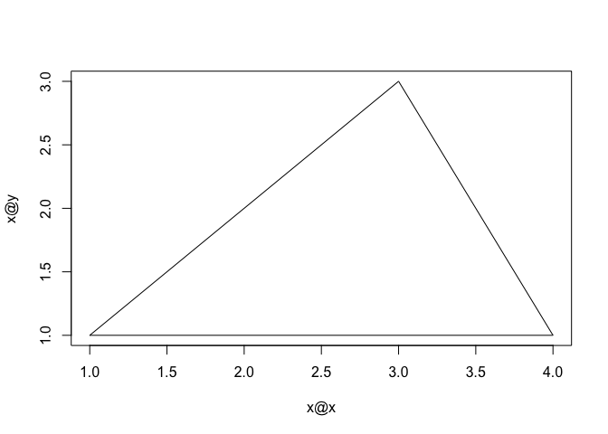

# Data Products
J Faleiro  
May 1, 2015  

# Required libraries


```r
if (!require("pacman")) install.packages("pacman")
pacman::p_load(googleVis, devtools, pryr)
```

# Shiny & rCharts

## rCharts example

rCharts is not on CRAN, so...


```r
library(devtools)
install_github('rCharts', 'ramnathv', ref = 'dev')
```

```
## Warning: Username parameter is deprecated. Please use ramnathv/rCharts
```

```
## Skipping install for github remote, the SHA1 (8d3fe35b) has not changed since last install.
##   Use `force = TRUE` to force installation
```

This setup is required, mainly to import CSS files that sets up width/height for the plots. It imports CSS files and JavaScript libraries from online resources. 


```r
library(rCharts)
## utility function to add required assets such as CSS and JS libraries
add_lib_assets <- function(lib, cdn = F,css=NULL) {
    assets = get_assets(get_lib(lib), cdn = cdn)
    if(!is.null(css)){assets$css=c(assets$css,css)}
    styles <- lapply(assets$css, function(style) {
        sprintf("<link rel='stylesheet' href=%s>", style)
    })

    scripts <- lapply(assets$jshead, function(script) {
        sprintf("<script type='text/javascript' src=%s></script>", script)
    })
    cat(paste(c(styles, scripts), collapse = "\n"))
}

# get assets from online repositories 
add_lib_assets("NVD3",cdn=TRUE,css="http://rawgithub.com/ramnathv/rCharts/master/inst/libraries/nvd3/css/rNVD3.css") 
```

<link rel='stylesheet' href=http://nvd3.org/assets/css/nv.d3.css>
<link rel='stylesheet' href=http://rawgithub.com/ramnathv/rCharts/master/inst/libraries/nvd3/css/rNVD3.css>
<script type='text/javascript' src=http://ajax.googleapis.com/ajax/libs/jquery/1.8.2/jquery.min.js></script>
<script type='text/javascript' src=http://d3js.org/d3.v3.min.js></script>
<script type='text/javascript' src=http://timelyportfolio.github.io/rCharts_nvd3_tests/libraries/widgets/nvd3/js/nv.d3.min-new.js></script>
<script type='text/javascript' src=http://nvd3.org/assets/lib/fisheye.js></script>

```r
add_lib_assets("Polycharts",cdn=TRUE)
```

<script type='text/javascript' src=http://ramnathv.github.io/rCharts/libraries/widgets/polycharts/js/polychart2.standalone.js></script>

Static plot, hover over data samples for more details


```r
names(iris) = gsub("\\.", "", names(iris))
r1<-rPlot(SepalLength ~ SepalWidth | Species, data = iris, color = 'Species', type = 'point')
r1$print("polyScatter")
```


<div id = 'polyScatter' class = 'rChart polycharts'></div>
<script type='text/javascript'>
    var chartParams = {
 "dom": "polyScatter",
"width":    800,
"height":    400,
"layers": [
 {
 "x": "SepalWidth",
"y": "SepalLength",
"data": {
 "SepalLength": [    5.1,    4.9,    4.7,    4.6,      5,    5.4,    4.6,      5,    4.4,    4.9,    5.4,    4.8,    4.8,    4.3,    5.8,    5.7,    5.4,    5.1,    5.7,    5.1,    5.4,    5.1,    4.6,    5.1,    4.8,      5,      5,    5.2,    5.2,    4.7,    4.8,    5.4,    5.2,    5.5,    4.9,      5,    5.5,    4.9,    4.4,    5.1,      5,    4.5,    4.4,      5,    5.1,    4.8,    5.1,    4.6,    5.3,      5,      7,    6.4,    6.9,    5.5,    6.5,    5.7,    6.3,    4.9,    6.6,    5.2,      5,    5.9,      6,    6.1,    5.6,    6.7,    5.6,    5.8,    6.2,    5.6,    5.9,    6.1,    6.3,    6.1,    6.4,    6.6,    6.8,    6.7,      6,    5.7,    5.5,    5.5,    5.8,      6,    5.4,      6,    6.7,    6.3,    5.6,    5.5,    5.5,    6.1,    5.8,      5,    5.6,    5.7,    5.7,    6.2,    5.1,    5.7,    6.3,    5.8,    7.1,    6.3,    6.5,    7.6,    4.9,    7.3,    6.7,    7.2,    6.5,    6.4,    6.8,    5.7,    5.8,    6.4,    6.5,    7.7,    7.7,      6,    6.9,    5.6,    7.7,    6.3,    6.7,    7.2,    6.2,    6.1,    6.4,    7.2,    7.4,    7.9,    6.4,    6.3,    6.1,    7.7,    6.3,    6.4,      6,    6.9,    6.7,    6.9,    5.8,    6.8,    6.7,    6.7,    6.3,    6.5,    6.2,    5.9 ],
"SepalWidth": [    3.5,      3,    3.2,    3.1,    3.6,    3.9,    3.4,    3.4,    2.9,    3.1,    3.7,    3.4,      3,      3,      4,    4.4,    3.9,    3.5,    3.8,    3.8,    3.4,    3.7,    3.6,    3.3,    3.4,      3,    3.4,    3.5,    3.4,    3.2,    3.1,    3.4,    4.1,    4.2,    3.1,    3.2,    3.5,    3.6,      3,    3.4,    3.5,    2.3,    3.2,    3.5,    3.8,      3,    3.8,    3.2,    3.7,    3.3,    3.2,    3.2,    3.1,    2.3,    2.8,    2.8,    3.3,    2.4,    2.9,    2.7,      2,      3,    2.2,    2.9,    2.9,    3.1,      3,    2.7,    2.2,    2.5,    3.2,    2.8,    2.5,    2.8,    2.9,      3,    2.8,      3,    2.9,    2.6,    2.4,    2.4,    2.7,    2.7,      3,    3.4,    3.1,    2.3,      3,    2.5,    2.6,      3,    2.6,    2.3,    2.7,      3,    2.9,    2.9,    2.5,    2.8,    3.3,    2.7,      3,    2.9,      3,      3,    2.5,    2.9,    2.5,    3.6,    3.2,    2.7,      3,    2.5,    2.8,    3.2,      3,    3.8,    2.6,    2.2,    3.2,    2.8,    2.8,    2.7,    3.3,    3.2,    2.8,      3,    2.8,      3,    2.8,    3.8,    2.8,    2.8,    2.6,      3,    3.4,    3.1,      3,    3.1,    3.1,    3.1,    2.7,    3.2,    3.3,      3,    2.5,      3,    3.4,      3 ],
"PetalLength": [    1.4,    1.4,    1.3,    1.5,    1.4,    1.7,    1.4,    1.5,    1.4,    1.5,    1.5,    1.6,    1.4,    1.1,    1.2,    1.5,    1.3,    1.4,    1.7,    1.5,    1.7,    1.5,      1,    1.7,    1.9,    1.6,    1.6,    1.5,    1.4,    1.6,    1.6,    1.5,    1.5,    1.4,    1.5,    1.2,    1.3,    1.4,    1.3,    1.5,    1.3,    1.3,    1.3,    1.6,    1.9,    1.4,    1.6,    1.4,    1.5,    1.4,    4.7,    4.5,    4.9,      4,    4.6,    4.5,    4.7,    3.3,    4.6,    3.9,    3.5,    4.2,      4,    4.7,    3.6,    4.4,    4.5,    4.1,    4.5,    3.9,    4.8,      4,    4.9,    4.7,    4.3,    4.4,    4.8,      5,    4.5,    3.5,    3.8,    3.7,    3.9,    5.1,    4.5,    4.5,    4.7,    4.4,    4.1,      4,    4.4,    4.6,      4,    3.3,    4.2,    4.2,    4.2,    4.3,      3,    4.1,      6,    5.1,    5.9,    5.6,    5.8,    6.6,    4.5,    6.3,    5.8,    6.1,    5.1,    5.3,    5.5,      5,    5.1,    5.3,    5.5,    6.7,    6.9,      5,    5.7,    4.9,    6.7,    4.9,    5.7,      6,    4.8,    4.9,    5.6,    5.8,    6.1,    6.4,    5.6,    5.1,    5.6,    6.1,    5.6,    5.5,    4.8,    5.4,    5.6,    5.1,    5.1,    5.9,    5.7,    5.2,      5,    5.2,    5.4,    5.1 ],
"PetalWidth": [    0.2,    0.2,    0.2,    0.2,    0.2,    0.4,    0.3,    0.2,    0.2,    0.1,    0.2,    0.2,    0.1,    0.1,    0.2,    0.4,    0.4,    0.3,    0.3,    0.3,    0.2,    0.4,    0.2,    0.5,    0.2,    0.2,    0.4,    0.2,    0.2,    0.2,    0.2,    0.4,    0.1,    0.2,    0.2,    0.2,    0.2,    0.1,    0.2,    0.2,    0.3,    0.3,    0.2,    0.6,    0.4,    0.3,    0.2,    0.2,    0.2,    0.2,    1.4,    1.5,    1.5,    1.3,    1.5,    1.3,    1.6,      1,    1.3,    1.4,      1,    1.5,      1,    1.4,    1.3,    1.4,    1.5,      1,    1.5,    1.1,    1.8,    1.3,    1.5,    1.2,    1.3,    1.4,    1.4,    1.7,    1.5,      1,    1.1,      1,    1.2,    1.6,    1.5,    1.6,    1.5,    1.3,    1.3,    1.3,    1.2,    1.4,    1.2,      1,    1.3,    1.2,    1.3,    1.3,    1.1,    1.3,    2.5,    1.9,    2.1,    1.8,    2.2,    2.1,    1.7,    1.8,    1.8,    2.5,      2,    1.9,    2.1,      2,    2.4,    2.3,    1.8,    2.2,    2.3,    1.5,    2.3,      2,      2,    1.8,    2.1,    1.8,    1.8,    1.8,    2.1,    1.6,    1.9,      2,    2.2,    1.5,    1.4,    2.3,    2.4,    1.8,    1.8,    2.1,    2.4,    2.3,    1.9,    2.3,    2.5,    2.3,    1.9,      2,    2.3,    1.8 ],
"Species": [ "setosa", "setosa", "setosa", "setosa", "setosa", "setosa", "setosa", "setosa", "setosa", "setosa", "setosa", "setosa", "setosa", "setosa", "setosa", "setosa", "setosa", "setosa", "setosa", "setosa", "setosa", "setosa", "setosa", "setosa", "setosa", "setosa", "setosa", "setosa", "setosa", "setosa", "setosa", "setosa", "setosa", "setosa", "setosa", "setosa", "setosa", "setosa", "setosa", "setosa", "setosa", "setosa", "setosa", "setosa", "setosa", "setosa", "setosa", "setosa", "setosa", "setosa", "versicolor", "versicolor", "versicolor", "versicolor", "versicolor", "versicolor", "versicolor", "versicolor", "versicolor", "versicolor", "versicolor", "versicolor", "versicolor", "versicolor", "versicolor", "versicolor", "versicolor", "versicolor", "versicolor", "versicolor", "versicolor", "versicolor", "versicolor", "versicolor", "versicolor", "versicolor", "versicolor", "versicolor", "versicolor", "versicolor", "versicolor", "versicolor", "versicolor", "versicolor", "versicolor", "versicolor", "versicolor", "versicolor", "versicolor", "versicolor", "versicolor", "versicolor", "versicolor", "versicolor", "versicolor", "versicolor", "versicolor", "versicolor", "versicolor", "versicolor", "virginica", "virginica", "virginica", "virginica", "virginica", "virginica", "virginica", "virginica", "virginica", "virginica", "virginica", "virginica", "virginica", "virginica", "virginica", "virginica", "virginica", "virginica", "virginica", "virginica", "virginica", "virginica", "virginica", "virginica", "virginica", "virginica", "virginica", "virginica", "virginica", "virginica", "virginica", "virginica", "virginica", "virginica", "virginica", "virginica", "virginica", "virginica", "virginica", "virginica", "virginica", "virginica", "virginica", "virginica", "virginica", "virginica", "virginica", "virginica", "virginica", "virginica" ] 
},
"facet": "Species",
"color": "Species",
"type": "point" 
} 
],
"facet": {
 "type": "wrap",
"var": "Species" 
},
"guides": [],
"coord": [],
"id": "polyScatter" 
}
    _.each(chartParams.layers, function(el){
        el.data = polyjs.data(el.data)
    })
    var graph_polyScatter = polyjs.chart(chartParams);
</script>

Slightly dynamic, you can select different types (grouped, stacked) for display.


```r
hair_eye_male <- subset(as.data.frame(HairEyeColor), Sex == "Male")
n1 <- nPlot(Freq ~ Hair, group = "Eye", data = hair_eye_male, type = "multiBarChart")
n1$print("nvd3mbar")
```


<div id = 'nvd3mbar' class = 'rChart nvd3'></div>
<script type='text/javascript'>
 $(document).ready(function(){
      drawnvd3mbar()
    });
    function drawnvd3mbar(){  
      var opts = {
 "dom": "nvd3mbar",
"width":    800,
"height":    400,
"x": "Hair",
"y": "Freq",
"group": "Eye",
"type": "multiBarChart",
"id": "nvd3mbar" 
},
        data = [
 {
 "Hair": "Black",
"Eye": "Brown",
"Sex": "Male",
"Freq":             32 
},
{
 "Hair": "Brown",
"Eye": "Brown",
"Sex": "Male",
"Freq":             53 
},
{
 "Hair": "Red",
"Eye": "Brown",
"Sex": "Male",
"Freq":             10 
},
{
 "Hair": "Blond",
"Eye": "Brown",
"Sex": "Male",
"Freq":              3 
},
{
 "Hair": "Black",
"Eye": "Blue",
"Sex": "Male",
"Freq":             11 
},
{
 "Hair": "Brown",
"Eye": "Blue",
"Sex": "Male",
"Freq":             50 
},
{
 "Hair": "Red",
"Eye": "Blue",
"Sex": "Male",
"Freq":             10 
},
{
 "Hair": "Blond",
"Eye": "Blue",
"Sex": "Male",
"Freq":             30 
},
{
 "Hair": "Black",
"Eye": "Hazel",
"Sex": "Male",
"Freq":             10 
},
{
 "Hair": "Brown",
"Eye": "Hazel",
"Sex": "Male",
"Freq":             25 
},
{
 "Hair": "Red",
"Eye": "Hazel",
"Sex": "Male",
"Freq":              7 
},
{
 "Hair": "Blond",
"Eye": "Hazel",
"Sex": "Male",
"Freq":              5 
},
{
 "Hair": "Black",
"Eye": "Green",
"Sex": "Male",
"Freq":              3 
},
{
 "Hair": "Brown",
"Eye": "Green",
"Sex": "Male",
"Freq":             15 
},
{
 "Hair": "Red",
"Eye": "Green",
"Sex": "Male",
"Freq":              7 
},
{
 "Hair": "Blond",
"Eye": "Green",
"Sex": "Male",
"Freq":              8 
} 
]
  
      if(!(opts.type==="pieChart" || opts.type==="sparklinePlus" || opts.type==="bulletChart")) {
        var data = d3.nest()
          .key(function(d){
            //return opts.group === undefined ? 'main' : d[opts.group]
            //instead of main would think a better default is opts.x
            return opts.group === undefined ? opts.y : d[opts.group];
          })
          .entries(data);
      }
      
      if (opts.disabled != undefined){
        data.map(function(d, i){
          d.disabled = opts.disabled[i]
        })
      }
      
      nv.addGraph(function() {
        var chart = nv.models[opts.type]()
          .width(opts.width)
          .height(opts.height)
          
        if (opts.type != "bulletChart"){
          chart
            .x(function(d) { return d[opts.x] })
            .y(function(d) { return d[opts.y] })
        }
          
         
        
          
        

        
        
        
      
       d3.select("#" + opts.id)
        .append('svg')
        .datum(data)
        .transition().duration(500)
        .call(chart);

       nv.utils.windowResize(chart.update);
       return chart;
      });
    };
</script>

## Google Vis Example

Initialization


```r
library(googleVis)
op <- options(gvis.plot.tag='chart')
```

Static plot:


```r
CityPopularity$Mean=mean(CityPopularity$Popularity)
CC <- gvisComboChart(CityPopularity, xvar='City',
          yvar=c('Mean', 'Popularity'),
          options=list(seriesType='bars',
                       width=450, height=300,
                       title='City Popularity',
                       series='{0: {type:\"line\"}}'))
plot(CC)
```

<!-- ComboChart generated in R 3.2.4 by googleVis 0.5.10 package -->
<!-- Tue May  3 10:31:18 2016 -->


<!-- jsHeader -->
<script type="text/javascript">
 
// jsData 
function gvisDataComboChartID1f4a4dd2dcd () {
var data = new google.visualization.DataTable();
var datajson =
[
 [
 "New York",
450,
200 
],
[
 "Boston",
450,
300 
],
[
 "Miami",
450,
400 
],
[
 "Chicago",
450,
500 
],
[
 "Los Angeles",
450,
600 
],
[
 "Houston",
450,
700 
] 
];
data.addColumn('string','City');
data.addColumn('number','Mean');
data.addColumn('number','Popularity');
data.addRows(datajson);
return(data);
}
 
// jsDrawChart
function drawChartComboChartID1f4a4dd2dcd() {
var data = gvisDataComboChartID1f4a4dd2dcd();
var options = {};
options["allowHtml"] = true;
options["seriesType"] = "bars";
options["width"] =    450;
options["height"] =    300;
options["title"] = "City Popularity";
options["series"] = {0: {type:"line"}};

    var chart = new google.visualization.ComboChart(
    document.getElementById('ComboChartID1f4a4dd2dcd')
    );
    chart.draw(data,options);
    

}
  
 
// jsDisplayChart
(function() {
var pkgs = window.__gvisPackages = window.__gvisPackages || [];
var callbacks = window.__gvisCallbacks = window.__gvisCallbacks || [];
var chartid = "corechart";
  
// Manually see if chartid is in pkgs (not all browsers support Array.indexOf)
var i, newPackage = true;
for (i = 0; newPackage && i < pkgs.length; i++) {
if (pkgs[i] === chartid)
newPackage = false;
}
if (newPackage)
  pkgs.push(chartid);
  
// Add the drawChart function to the global list of callbacks
callbacks.push(drawChartComboChartID1f4a4dd2dcd);
})();
function displayChartComboChartID1f4a4dd2dcd() {
  var pkgs = window.__gvisPackages = window.__gvisPackages || [];
  var callbacks = window.__gvisCallbacks = window.__gvisCallbacks || [];
  window.clearTimeout(window.__gvisLoad);
  // The timeout is set to 100 because otherwise the container div we are
  // targeting might not be part of the document yet
  window.__gvisLoad = setTimeout(function() {
  var pkgCount = pkgs.length;
  google.load("visualization", "1", { packages:pkgs, callback: function() {
  if (pkgCount != pkgs.length) {
  // Race condition where another setTimeout call snuck in after us; if
  // that call added a package, we must not shift its callback
  return;
}
while (callbacks.length > 0)
callbacks.shift()();
} });
}, 100);
}
 
// jsFooter
</script>
 
<!-- jsChart -->  
<script type="text/javascript" src="https://www.google.com/jsapi?callback=displayChartComboChartID1f4a4dd2dcd"></script>
 
<!-- divChart -->
  
<div id="ComboChartID1f4a4dd2dcd" 
  style="width: 450; height: 300;">
</div>

Some animation:


```r
M <- gvisMotionChart(Fruits, 'Fruit', 'Year', options=list(width=600, heigth=400))
plot(M)
```

<!-- MotionChart generated in R 3.2.4 by googleVis 0.5.10 package -->
<!-- Tue May  3 10:31:18 2016 -->


<!-- jsHeader -->
<script type="text/javascript">
 
// jsData 
function gvisDataMotionChartID1f4a4a9a59bc () {
var data = new google.visualization.DataTable();
var datajson =
[
 [
 "Apples",
2008,
"West",
98,
78,
20,
"2008-12-31" 
],
[
 "Apples",
2009,
"West",
111,
79,
32,
"2009-12-31" 
],
[
 "Apples",
2010,
"West",
89,
76,
13,
"2010-12-31" 
],
[
 "Oranges",
2008,
"East",
96,
81,
15,
"2008-12-31" 
],
[
 "Bananas",
2008,
"East",
85,
76,
9,
"2008-12-31" 
],
[
 "Oranges",
2009,
"East",
93,
80,
13,
"2009-12-31" 
],
[
 "Bananas",
2009,
"East",
94,
78,
16,
"2009-12-31" 
],
[
 "Oranges",
2010,
"East",
98,
91,
7,
"2010-12-31" 
],
[
 "Bananas",
2010,
"East",
81,
71,
10,
"2010-12-31" 
] 
];
data.addColumn('string','Fruit');
data.addColumn('number','Year');
data.addColumn('string','Location');
data.addColumn('number','Sales');
data.addColumn('number','Expenses');
data.addColumn('number','Profit');
data.addColumn('string','Date');
data.addRows(datajson);
return(data);
}
 
// jsDrawChart
function drawChartMotionChartID1f4a4a9a59bc() {
var data = gvisDataMotionChartID1f4a4a9a59bc();
var options = {};
options["width"] =    600;
options["height"] =    500;
options["state"] = "";
options["heigth"] =    400;

    var chart = new google.visualization.MotionChart(
    document.getElementById('MotionChartID1f4a4a9a59bc')
    );
    chart.draw(data,options);
    

}
  
 
// jsDisplayChart
(function() {
var pkgs = window.__gvisPackages = window.__gvisPackages || [];
var callbacks = window.__gvisCallbacks = window.__gvisCallbacks || [];
var chartid = "motionchart";
  
// Manually see if chartid is in pkgs (not all browsers support Array.indexOf)
var i, newPackage = true;
for (i = 0; newPackage && i < pkgs.length; i++) {
if (pkgs[i] === chartid)
newPackage = false;
}
if (newPackage)
  pkgs.push(chartid);
  
// Add the drawChart function to the global list of callbacks
callbacks.push(drawChartMotionChartID1f4a4a9a59bc);
})();
function displayChartMotionChartID1f4a4a9a59bc() {
  var pkgs = window.__gvisPackages = window.__gvisPackages || [];
  var callbacks = window.__gvisCallbacks = window.__gvisCallbacks || [];
  window.clearTimeout(window.__gvisLoad);
  // The timeout is set to 100 because otherwise the container div we are
  // targeting might not be part of the document yet
  window.__gvisLoad = setTimeout(function() {
  var pkgCount = pkgs.length;
  google.load("visualization", "1", { packages:pkgs, callback: function() {
  if (pkgCount != pkgs.length) {
  // Race condition where another setTimeout call snuck in after us; if
  // that call added a package, we must not shift its callback
  return;
}
while (callbacks.length > 0)
callbacks.shift()();
} });
}, 100);
}
 
// jsFooter
</script>
 
<!-- jsChart -->  
<script type="text/javascript" src="https://www.google.com/jsapi?callback=displayChartMotionChartID1f4a4a9a59bc"></script>
 
<!-- divChart -->
  
<div id="MotionChartID1f4a4a9a59bc" 
  style="width: 600; height: 500;">
</div>

```r
options(op)
```

You can see a number of other cool plots and customizations with `library(googleViz); demo(googleViz)`

# Classes

Examples of a few classes


```r
class(rnorm(100))
```

```
## [1] "numeric"
```


```r
class(NA)
```

```
## [1] "logical"
```


```r
class('foo')
```

```
## [1] "character"
```


```r
x <- rnorm(100)
y <- x + rnorm(100)
fit <- lm(y ~ x)
class(fit)
```

```
## [1] "lm"
```

Which method is being called?


```r
set.seed(2)
x <- rnorm(100)
class(x)
```

```
## [1] "numeric"
```

```r
mean(x)
```

```
## [1] -0.03069816
```

The class of x is numeric, but there is no `mean` function for numeric objects. Se we call the default function for method mean.


```r
getS3method('mean', 'default')
```

```
## function (x, trim = 0, na.rm = FALSE, ...) 
## {
##     if (!is.numeric(x) && !is.complex(x) && !is.logical(x)) {
##         warning("argument is not numeric or logical: returning NA")
##         return(NA_real_)
##     }
##     if (na.rm) 
##         x <- x[!is.na(x)]
##     if (!is.numeric(trim) || length(trim) != 1L) 
##         stop("'trim' must be numeric of length one")
##     n <- length(x)
##     if (trim > 0 && n) {
##         if (is.complex(x)) 
##             stop("trimmed means are not defined for complex data")
##         if (anyNA(x)) 
##             return(NA_real_)
##         if (trim >= 0.5) 
##             return(stats::median(x, na.rm = FALSE))
##         lo <- floor(n * trim) + 1
##         hi <- n + 1 - lo
##         x <- sort.int(x, partial = unique(c(lo, hi)))[lo:hi]
##     }
##     .Internal(mean(x))
## }
## <bytecode: 0x7fd6f472acd0>
## <environment: namespace:base>
```

S4 classes: creating a Polygon class:


```r
library(methods)
setClass('polygon', representation(x='numeric', y='numeric'))
```

Creating a plot `method` with `setMethod`:


```r
setMethod('plot', 'polygon',
          function(x, y, ...) {
              plot(x@x, x@y, type='n', ...)
              xp <- c(x@x, x@x[1])
              yp <- c(x@y, x@y[1])
              lines(xp, yp)
              })
```

```
## Creating a generic function for 'plot' from package 'graphics' in the global environment
```

```
## [1] "plot"
```

And here it is:


```r
showMethods('plot')
```

```
## Function: plot (package graphics)
## x="ANY"
## x="git_repository"
## x="polygon"
```

And to get the body of this S4 method:


```r
getMethod('plot', 'polygon')
```

```
## Method Definition:
## 
## function (x, y, ...) 
## {
##     plot(x@x, x@y, type = "n", ...)
##     xp <- c(x@x, x@x[1])
##     yp <- c(x@y, x@y[1])
##     lines(xp, yp)
## }
## 
## Signatures:
##         x        
## target  "polygon"
## defined "polygon"
```

Finally, using `polygon` and `plot`:


```r
p <- new('polygon', x=c(1,2,3,4), y=c(1,2,3,1))
plot(p)
```

<!-- -->

How to find out if a method is generic?


```r
sapply(c('mean', 'show', 'lm', 'colSums', 'dgamma', 'predict'), isGeneric)
```

```
##    mean    show      lm colSums  dgamma predict 
##   FALSE    TRUE   FALSE   FALSE   FALSE   FALSE
```


```r
library(pryr)
c(mean=ftype(mean), show=ftype(show), lm=ftype(lm), colsums=ftype(colSums), dgamma=ftype(dgamma), predict=ftype(predict))
```

```
##      mean1      mean2      show1      show2         lm    colsums 
##       "s3"  "generic"       "s4"  "generic" "function" "internal" 
##     dgamma   predict1   predict2 
## "function"       "s3"  "generic"
```
