# Machine Learning: Algorithms
J Faleiro  
April 28, 2015  

# Required libraries


```r
if (!require("pacman")) install.packages("pacman")
pacman::p_load(caret, e1071, kernlab, ggplot2, ISLR, Hmisc, 
               gridExtra, RANN, AppliedPredictiveModeling, rattle, magrittr, 
               rpart.plot, ElemStatLearn, party, randomForest, gbm,
               MASS, klaR, dplyr, pgmm)
```

# Trees

## Classifying Species of Plants

Trying to predict (classify) species of plants based on trees. Which features I have?


```r
library(ggplot2); data(iris)
names(iris)
```

```
## [1] "Sepal.Length" "Sepal.Width"  "Petal.Length" "Petal.Width" 
## [5] "Species"
```

Where `species` is the outcome.


```r
table(iris$Species)
```

```
## 
##     setosa versicolor  virginica 
##         50         50         50
```

50 samples of each.


```r
inTrain <- createDataPartition(y=iris$Species, p=0.7, list=FALSE)
training <- iris[inTrain,]
testing <- iris[-inTrain,]
c(dim(training),'|',dim(testing))
```

```
## [1] "105" "5"   "|"   "45"  "5"
```


```r
qplot(Petal.Width, Sepal.Width, colour=Species, data=training)
```

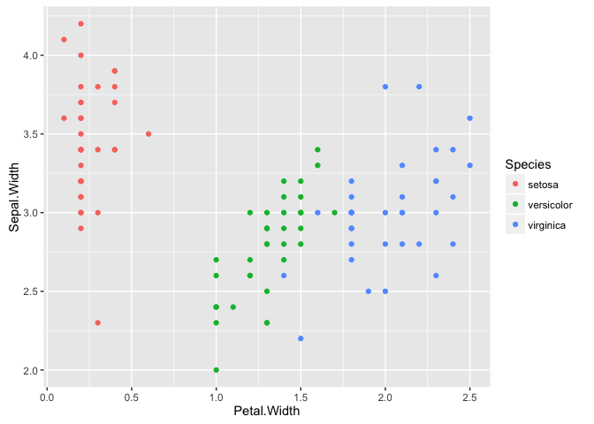<!-- -->

3 very distinct clusters.

We will use `train` with `method='rpart'` the method for classification by trees. There are other tree building options in R: `party`, and out of the caret package `tree`.


```r
library(caret)
modFit <- train(Species ~ ., method='rpart', data=training)
print(modFit$finalModel)
```

```
## n= 105 
## 
## node), split, n, loss, yval, (yprob)
##       * denotes terminal node
## 
## 1) root 105 70 setosa (0.33333333 0.33333333 0.33333333)  
##   2) Petal.Length< 2.6 35  0 setosa (1.00000000 0.00000000 0.00000000) *
##   3) Petal.Length>=2.6 70 35 versicolor (0.00000000 0.50000000 0.50000000)  
##     6) Petal.Length< 4.75 32  0 versicolor (0.00000000 1.00000000 0.00000000) *
##     7) Petal.Length>=4.75 38  3 virginica (0.00000000 0.07894737 0.92105263) *
```

You can read the splits to understand what the classification algo is doing. 

You can also plot the dendogram of the classification tree:


```r
plot(modFit$finalModel, uniform=TRUE, main='classification tree')
text(modFit$finalModel, use.n=TRUE, all=TRUE, cex=.8)
```

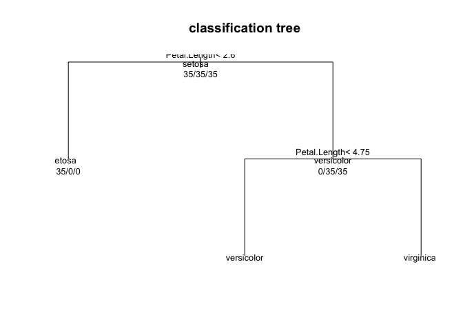<!-- -->

Or a prettier plot with `rattle`:


```r
library(rattle)
fancyRpartPlot(modFit$finalModel)
```

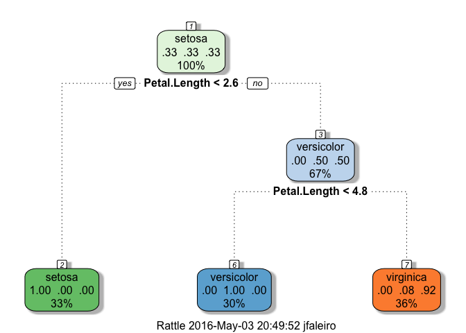<!-- -->

You can predict new values with the usual `predict`:


```r
predict(modFit, newData=testing)
```

```
##   [1] setosa     setosa     setosa     setosa     setosa     setosa    
##   [7] setosa     setosa     setosa     setosa     setosa     setosa    
##  [13] setosa     setosa     setosa     setosa     setosa     setosa    
##  [19] setosa     setosa     setosa     setosa     setosa     setosa    
##  [25] setosa     setosa     setosa     setosa     setosa     setosa    
##  [31] setosa     setosa     setosa     setosa     setosa     versicolor
##  [37] versicolor virginica  versicolor versicolor versicolor versicolor
##  [43] versicolor versicolor versicolor versicolor versicolor versicolor
##  [49] versicolor versicolor versicolor versicolor versicolor virginica 
##  [55] virginica  versicolor versicolor versicolor versicolor versicolor
##  [61] versicolor versicolor versicolor versicolor versicolor versicolor
##  [67] versicolor versicolor versicolor versicolor virginica  virginica 
##  [73] virginica  virginica  virginica  virginica  virginica  virginica 
##  [79] virginica  virginica  virginica  virginica  virginica  virginica 
##  [85] virginica  virginica  virginica  virginica  virginica  virginica 
##  [91] virginica  virginica  virginica  virginica  virginica  virginica 
##  [97] virginica  virginica  virginica  virginica  virginica  virginica 
## [103] virginica  virginica  virginica 
## Levels: setosa versicolor virginica
```

## Classifying Cell Segmentations


```r
library(caret)
library(AppliedPredictiveModeling)
data(segmentationOriginal)
```

Subsetting into training and testing:


```r
library(dplyr)
set.seed(125)
training <- filter(segmentationOriginal, Case == 'Train')
testing <- filter(segmentationOriginal, Case == 'Test')
c(dim(training),'|',dim(testing))
```

```
## [1] "1009" "119"  "|"    "1010" "119"
```

Fitting a model


```r
set.seed(125)
modFit <- train(Class ~ ., method='rpart', data=training)
print(modFit$finalModel)
```

```
## n= 1009 
## 
## node), split, n, loss, yval, (yprob)
##       * denotes terminal node
## 
## 1) root 1009 373 PS (0.63032706 0.36967294)  
##   2) TotalIntenCh2< 45323.5 454  34 PS (0.92511013 0.07488987) *
##   3) TotalIntenCh2>=45323.5 555 216 WS (0.38918919 0.61081081)  
##     6) FiberWidthCh1< 9.673245 154  47 PS (0.69480519 0.30519481) *
##     7) FiberWidthCh1>=9.673245 401 109 WS (0.27182045 0.72817955) *
```

Visualizing the tree


```r
library(rattle)
fancyRpartPlot(modFit$finalModel)
```

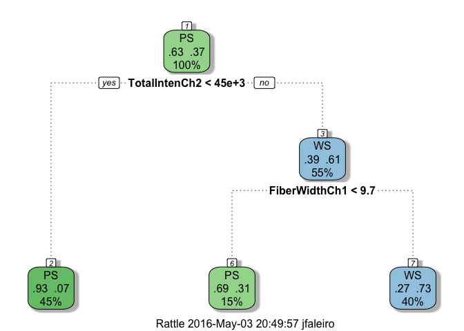<!-- -->

Predicting for specific values:

1. TotalIntench2 = 23,000; FiberWidthCh1 = 10; PerimStatusCh1=2
2. TotalIntench2 = 50,000; FiberWidthCh1 = 10;VarIntenCh4 = 100
3. TotalIntench2 = 57,000; FiberWidthCh1 = 8;VarIntenCh4 = 100
4. FiberWidthCh1 = 8;VarIntenCh4 = 100; PerimStatusCh1=2 

You can do visually, on the tree plotted above, where `Class` will be, for each case:

1. PS
2. WS
3. PS
4. cannot be calculated

I do not know how to come up to the same values using a computational, non visual approach. R's handling of NA values in prediction algorithms is weird:


```r
library(dplyr)
emptyDf <- subset(testing, FALSE) # empty df with all columns
df <- data.frame(TotalIntench2=c(23000,50000,57000,NA),
                 FiberWidthCh1=c(10,10,8,8),
                 PerimStatusCh1=c(2,NA,NA,2),
                 VarIntenCh4=c(NA,100,100,100))
df2 <- rbind_list(emptyDf, df)
```


```r
predict(modFit, newdata=df2, na.action=na.omit)
```

```
## factor(0)
## Levels: PS WS
```

Omits all `NA` values, dropping all outcomes. And the alternative:


```r
predict(modFit, newdata=df2, na.action=na.pass)
```

```
## [1] WS WS PS PS
## Levels: PS WS
```

Produces random results. The results are different. The solution would be around imputing missing results, I do not fully control the technique.

## Classifying Olive Oil


```r
library(pgmm)
data(olive)
olive = olive[,-1]
summary(olive)
```

```
##       Area        Palmitic     Palmitoleic        Stearic     
##  Min.   :1.0   Min.   : 610   Min.   : 15.00   Min.   :152.0  
##  1st Qu.:3.0   1st Qu.:1095   1st Qu.: 87.75   1st Qu.:205.0  
##  Median :3.0   Median :1201   Median :110.00   Median :223.0  
##  Mean   :4.6   Mean   :1232   Mean   :126.09   Mean   :228.9  
##  3rd Qu.:7.0   3rd Qu.:1360   3rd Qu.:169.25   3rd Qu.:249.0  
##  Max.   :9.0   Max.   :1753   Max.   :280.00   Max.   :375.0  
##      Oleic         Linoleic        Linolenic       Arachidic    
##  Min.   :6300   Min.   : 448.0   Min.   : 0.00   Min.   :  0.0  
##  1st Qu.:7000   1st Qu.: 770.8   1st Qu.:26.00   1st Qu.: 50.0  
##  Median :7302   Median :1030.0   Median :33.00   Median : 61.0  
##  Mean   :7312   Mean   : 980.5   Mean   :31.89   Mean   : 58.1  
##  3rd Qu.:7680   3rd Qu.:1180.8   3rd Qu.:40.25   3rd Qu.: 70.0  
##  Max.   :8410   Max.   :1470.0   Max.   :74.00   Max.   :105.0  
##    Eicosenoic   
##  Min.   : 1.00  
##  1st Qu.: 2.00  
##  Median :17.00  
##  Mean   :16.28  
##  3rd Qu.:28.00  
##  Max.   :58.00
```

Fitting...


```r
set.seed(125)
modFit <- train(Area ~ ., method='rpart', data=olive)
```

```
## Warning in nominalTrainWorkflow(x = x, y = y, wts = weights, info =
## trainInfo, : There were missing values in resampled performance measures.
```

```r
print(modFit$finalModel)
```

```
## n= 572 
## 
## node), split, n, deviance, yval
##       * denotes terminal node
## 
## 1) root 572 3171.32000 4.599650  
##   2) Eicosenoic>=6.5 323  176.82970 2.783282 *
##   3) Eicosenoic< 6.5 249  546.51410 6.955823  
##     6) Linoleic>=1053.5 98   21.88776 5.336735 *
##     7) Linoleic< 1053.5 151  100.99340 8.006623 *
```

Visualizing...


```r
fancyRpartPlot(modFit$finalModel)
```

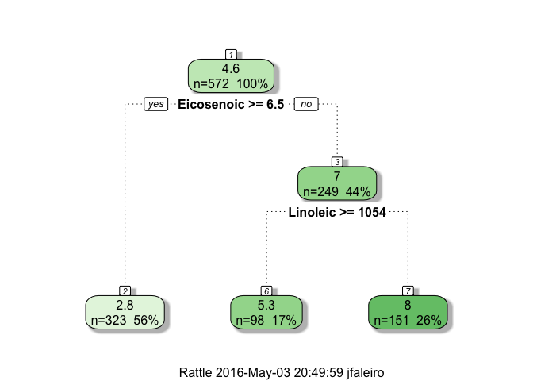<!-- -->

Predicting...


```r
predict(modFit, newdata=as.data.frame(t(colMeans(olive))))
```

```
##        1 
## 2.783282
```

This result is strange because `Area` should be a qualitative variable - but tree is reporting the average value of Area as a numeric variable in the leaf predicted for newdata.

# Bagging

Short for 'bootstrap aggregating`. Example: ozone data


```r
library(ElemStatLearn); data(ozone)
ozone <- ozone[order(ozone$ozone),]
head(ozone)
```

```
##     ozone radiation temperature wind
## 17      1         8          59  9.7
## 19      4        25          61  9.7
## 14      6        78          57 18.4
## 45      7        48          80 14.3
## 106     7        49          69 10.3
## 7       8        19          61 20.1
```

We will try to predict `temperature` as a function of `ozone`.

## Bagged LOESS

How to calculate a bagged LOESS curve, a curve that captures a the variability on past measurements:


```r
ll <- matrix(NA, nrow=10, ncol=155)
for (i in 1:10) {
    ss <- sample(1:dim(ozone)[1], replace=TRUE) # sample with replacement, the entire dataset
    ozone0 <- ozone[ss,] 
    ozone0 <- ozone0[order(ozone0$ozone),] # ozone0 is the bootstrap of ozone
    loess0 <- loess(temperature ~ ozone, data=ozone0, span=0.2) # smoothing curve
    ll[i,] <- predict(loess0, newdata=data.frame(ozone=1:155)) # i-th row is the prediction
}
```

```
## Warning in simpleLoess(y, x, w, span, degree = degree, parametric =
## parametric, : pseudoinverse used at 14
```

```
## Warning in simpleLoess(y, x, w, span, degree = degree, parametric =
## parametric, : neighborhood radius 1
```

```
## Warning in simpleLoess(y, x, w, span, degree = degree, parametric =
## parametric, : reciprocal condition number 0
```

```
## Warning in simpleLoess(y, x, w, span, degree = degree, parametric =
## parametric, : There are other near singularities as well. 1
```

Some other bagging available as a `method` in `train` function: `bagEarth`, `treeBag`, `bagFDA`. Or you can use the `bag` function.

How does it look like?


```r
plot(ozone$ozone, ozone$temperature, pch=19, cex=0.5)
for (i in 1:10) {
    lines(1:155, ll[i,], col='grey', lwd=2)
}
lines(1:155, apply(ll, 2, mean), col='red', lwd=2)
```

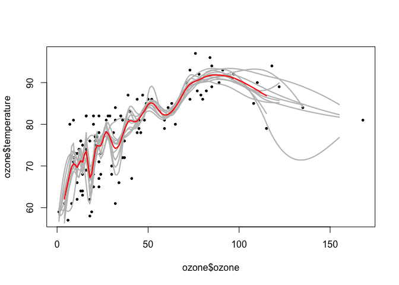<!-- -->

You can do your own bagging in caret:


```r
predictors <- data.frame(ozone=ozone$ozone)
temperature <- ozone$temperature
treebag <- bag(predictors, temperature, B=10,
               bagControl=bagControl(fit=ctreeBag$fit,
                                     predict=ctreeBag$pred,
                                     aggregate=ctreeBag$aggregate))
```

```
## Warning: executing %dopar% sequentially: no parallel backend registered
```

How well does it capture a trend in data points?


```r
plot(ozone$ozone, temperature, col='lightgrey',pch=19)
points(ozone$ozone, predict(treebag$fits[[1]]$fit, predictors), pch=19, col='red')
points(ozone$ozone, predict(treebag, predictors), pch=19, col='blue') # custom bagging
```

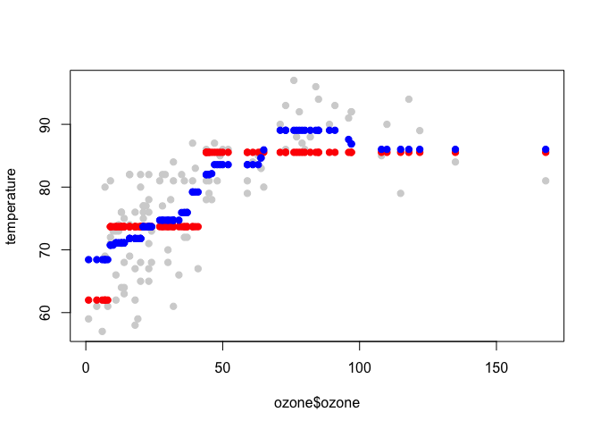<!-- -->

## Parts of Bagging

### Fitting


```r
ctreeBag$fit
```

```
## function (x, y, ...) 
## {
##     loadNamespace("party")
##     data <- as.data.frame(x)
##     data$y <- y
##     party::ctree(y ~ ., data = data)
## }
## <environment: namespace:caret>
```

### Prediction


```r
ctreeBag$pred
```

```
## function (object, x) 
## {
##     if (!is.data.frame(x)) 
##         x <- as.data.frame(x)
##     obsLevels <- levels(object@data@get("response")[, 1])
##     if (!is.null(obsLevels)) {
##         rawProbs <- party::treeresponse(object, x)
##         probMatrix <- matrix(unlist(rawProbs), ncol = length(obsLevels), 
##             byrow = TRUE)
##         out <- data.frame(probMatrix)
##         colnames(out) <- obsLevels
##         rownames(out) <- NULL
##     }
##     else out <- unlist(party::treeresponse(object, x))
##     out
## }
## <environment: namespace:caret>
```

### Aggregation


```r
ctreeBag$aggregate
```

```
## function (x, type = "class") 
## {
##     if (is.matrix(x[[1]]) | is.data.frame(x[[1]])) {
##         pooled <- x[[1]] & NA
##         classes <- colnames(pooled)
##         for (i in 1:ncol(pooled)) {
##             tmp <- lapply(x, function(y, col) y[, col], col = i)
##             tmp <- do.call("rbind", tmp)
##             pooled[, i] <- apply(tmp, 2, median)
##         }
##         if (type == "class") {
##             out <- factor(classes[apply(pooled, 1, which.max)], 
##                 levels = classes)
##         }
##         else out <- as.data.frame(pooled)
##     }
##     else {
##         x <- matrix(unlist(x), ncol = length(x))
##         out <- apply(x, 1, median)
##     }
##     out
## }
## <environment: namespace:caret>
```

# Random Forests

## Definition and Use

Average of different paths taken on different executions through different paths. Example, iris data:


```r
set.seed(123)
data(iris); library(ggplot2); library(caret)
inTrain <- createDataPartition(y=iris$Species, p=0.7, list=FALSE)
training <- iris[inTrain,]
testing <- iris[-inTrain,]
```

Training using random forests, `method='rf'`, outcome is `Species`, regressors are all the other features.


```r
modFit <- train(Species ~ ., data=training, method='rf', prox=TRUE)
modFit
```

```
## Random Forest 
## 
## 105 samples
##   4 predictor
##   3 classes: 'setosa', 'versicolor', 'virginica' 
## 
## No pre-processing
## Resampling: Bootstrapped (25 reps) 
## Summary of sample sizes: 105, 105, 105, 105, 105, 105, ... 
## Resampling results across tuning parameters:
## 
##   mtry  Accuracy   Kappa    
##   2     0.9421392  0.9119782
##   3     0.9440956  0.9149427
##   4     0.9430724  0.9134138
## 
## Accuracy was used to select the optimal model using  the largest value.
## The final value used for the model was mtry = 3.
```

You can check any individual trees, i.e. 


```r
getTree(modFit$finalModel, k=2) # second tree
```

```
##   left daughter right daughter split var split point status prediction
## 1             2              3         3        2.45      1          0
## 2             0              0         0        0.00     -1          1
## 3             4              5         4        1.70      1          0
## 4             6              7         3        5.35      1          0
## 5             0              0         0        0.00     -1          3
## 6             0              0         0        0.00     -1          2
## 7             0              0         0        0.00     -1          3
```

You can check for "class centers" as well, cluster centers, obtained with `classCenter`:


```r
irisP <- as.data.frame(classCenter(training[,c(3,4)], training$Species, modFit$finalModel$prox))
irisP$Species <- rownames(irisP)
qplot(Petal.Width, Petal.Length, col=Species, data=training) +
    geom_point(aes(x=Petal.Width, y=Petal.Length, col=Species), size=5, shape=4, data=irisP) # plot X's
```

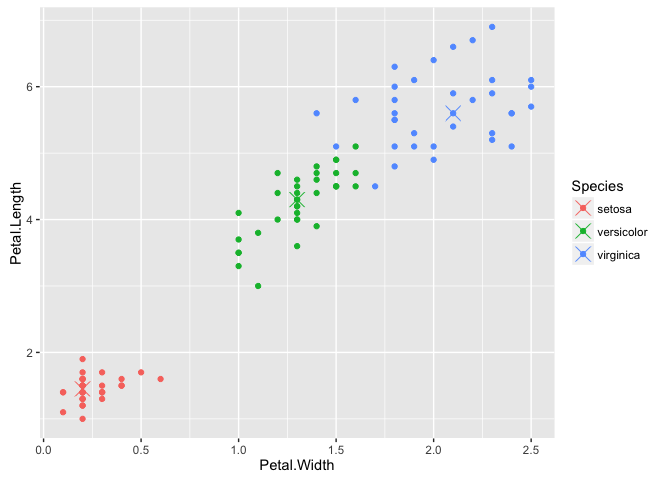<!-- -->

You can predict new values with `predict`


```r
pred <- predict(modFit, testing)
```

And check for correct predictions:


```r
testing$predRight <- pred==testing$Species
table(pred, testing$Species)
```

```
##             
## pred         setosa versicolor virginica
##   setosa         15          0         0
##   versicolor      0         13         1
##   virginica       0          2        14
```

We can see a few mis-classified values, let's check where they are:


```r
qplot(Petal.Width, Petal.Length, colour=predRight, data=testing, main='data predictions')
```

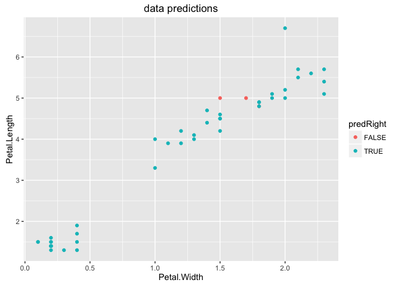<!-- -->

You can see the misclassified values are right on the border of one or more clusters.

## Variable Importance


```r
library(ElemStatLearn)
data(vowel.train)
data(vowel.test)
```


```r
vowel.train$y <- as.factor(vowel.train$y)
vowel.test$y <- as.factor(vowel.test$y)
```


```r
set.seed(33833) 
modFit <- train(y ~ ., data=vowel.train, method='rf')
```


```r
varImp(modFit, data=vowel.train)
```

```
## rf variable importance
## 
##       Overall
## x.1  100.0000
## x.2   98.5960
## x.5   44.3214
## x.6   28.3926
## x.8   14.9865
## x.9    6.7483
## x.3    4.8055
## x.4    4.5061
## x.7    0.5042
## x.10   0.0000
```


```r
set.seed(33833) 
modFit <- randomForest(y ~ ., data=vowel.train)
```


```r
varImp(modFit)
```

```
##       Overall
## x.1  89.12864
## x.2  91.24009
## x.3  33.08111
## x.4  34.24433
## x.5  50.25539
## x.6  43.33148
## x.7  31.88132
## x.8  42.92470
## x.9  33.37031
## x.10 29.59956
```


```r
order(varImp(modFit), decreasing = TRUE)
```

```
##  [1]  2  1  5  6  8  4  9  3  7 10
```
# Boosting

Using boosting in our Wage example


```r
set.seed(123)
library(ggplot2); library(caret); library(ISLR); data(wage)
```

```
## Warning in data(wage): data set 'wage' not found
```

```r
Wage <- subset(Wage, select=-c(logwage))
inTrain <- createDataPartition(y=Wage$wage, p=0.7, list=FALSE)
training <- Wage[inTrain,]
testing <- Wage[-inTrain,]
```

Fitting the model with `gbm`, "boosting with trees". It has to be cached this is really slow:


```r
modFit <- train(wage ~ ., method='gbm', data=training, verbose=FALSE)
print(modFit)
```

```
## Stochastic Gradient Boosting 
## 
## 2102 samples
##   10 predictor
## 
## No pre-processing
## Resampling: Bootstrapped (25 reps) 
## Summary of sample sizes: 2102, 2102, 2102, 2102, 2102, 2102, ... 
## Resampling results across tuning parameters:
## 
##   interaction.depth  n.trees  RMSE      Rsquared 
##   1                   50      34.53147  0.3124394
##   1                  100      33.94784  0.3200580
##   1                  150      33.88889  0.3198883
##   2                   50      33.97457  0.3201718
##   2                  100      33.88419  0.3202670
##   2                  150      33.95668  0.3177865
##   3                   50      33.88911  0.3207441
##   3                  100      33.99469  0.3163406
##   3                  150      34.24555  0.3083372
## 
## Tuning parameter 'shrinkage' was held constant at a value of 0.1
## 
## Tuning parameter 'n.minobsinnode' was held constant at a value of 10
## RMSE was used to select the optimal model using  the smallest value.
## The final values used for the model were n.trees = 100,
##  interaction.depth = 2, shrinkage = 0.1 and n.minobsinnode = 10.
```

How did it do? Let's plot the predicted `wage` against the `wage` in testing set. Ideally it should all fit in a perfect line.


```r
qplot(predict(modFit, testing), wage, data=testing)
```

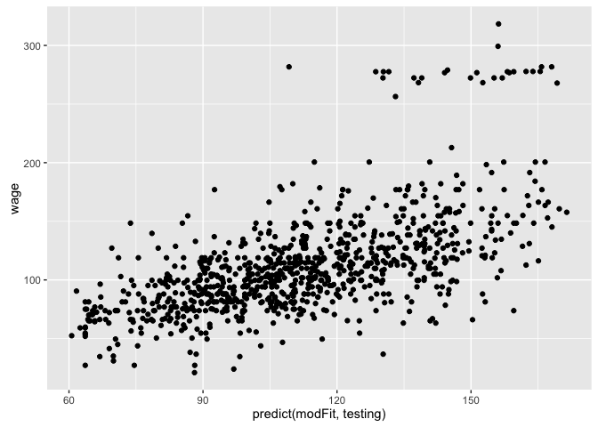<!-- -->

Not too bad, a lot of variability, outliers but there is a correlation.

# Model Based Prediction


```r
set.seed(123)
data(iris); library(ggplot2); library(caret)
names(iris)
```

```
## [1] "Sepal.Length" "Sepal.Width"  "Petal.Length" "Petal.Width" 
## [5] "Species"
```


```r
table(iris$Species)
```

```
## 
##     setosa versicolor  virginica 
##         50         50         50
```


```r
inTrain <- createDataPartition(y=iris$Species, p=0.7, list=FALSE)
training <- iris[inTrain,]
testing <- iris[-inTrain,]
c(dim(training), dim(testing))
```

```
## [1] 105   5  45   5
```

Training with LDA classification, `method='lda'`: 


```r
modlda <- train(Species ~ ., data=training, method='lda')
plda <- predict(modlda, testing)
```

Training with naive bayesian classification, `method='nb'`:


```r
modnb <- train(Species ~ ., data=training, method='nb')
pnb <- predict(modnb, testing)
```

How did they agree?


```r
table(plda, pnb)
```

```
##             pnb
## plda         setosa versicolor virginica
##   setosa         15          0         0
##   versicolor      0         13         1
##   virginica       0          1        15
```

The two methods disagree on 2 instances. Where are them?


```r
equalPredictions <- (plda == pnb)
qplot(Petal.Width, Sepal.Width, col=equalPredictions, data=testing)
```

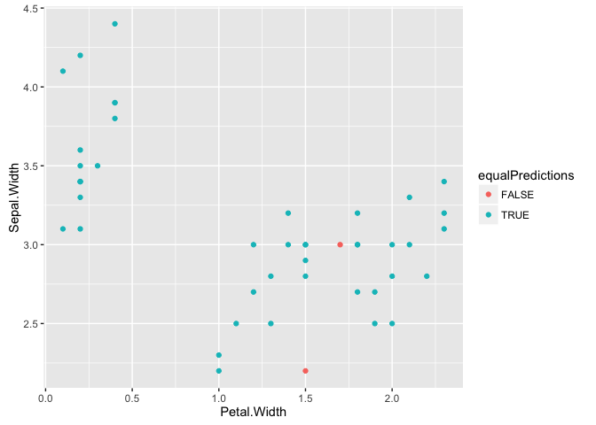<!-- -->

They have been misclassified either because they lay in between clusters or is an outlier.
