# Machine Learning
J Faleiro  
April 19, 2015  

# Required libraries


```r
if (!require("pacman")) install.packages("pacman")
pacman::p_load(caret, e1071, kernlab, ggplot2, ISLR, Hmisc, gridExtra, RANN, AppliedPredictiveModeling)
```

# Prediction

## Building a predictor

Steps:

1. Question
2. Input data
3. Features
4. Algorithm
5. Parameters
6. Evaluation

Spam example:


```r
library(kernlab)
data(spam)
head(spam$your)
```

```
## [1] 0.96 1.59 0.51 0.31 0.31 0.00
```

Density distributions of word 'your' in spam and non-spam emails


```r
plot(density(spam$your[spam$type=='nonspam']), 
     col='blue', main='', xlab="frequency of word 'your'")
lines(density(spam$your[spam$type=='spam']), col='red')
```


* what blue shows: a lot of non-spam emails have close to zero 'your'
* what red shows: a lot of spam emails have from 0 to 4, some with 8, words 'your'

Algorithm. put a cutoff threshold, right after the peak of blue non-spam emails. Anything having more 'your' word above that, is spam, not spam otherwise.


```r
prediction <- ifelse(spam$your > 0.5, 'spam', 'nonspam')
table(prediction, spam$type)/length(spam$type)
```

```
##           
## prediction   nonspam      spam
##    nonspam 0.4590306 0.1017170
##    spam    0.1469246 0.2923278
```

Meaning, with this simple algorithm you will be right about spam detection approximatelly 75% of the time:


```r
0.4590306 + 0.2923278
```

```
## [1] 0.7513584
```

## In sample error vs out of sample errors

Building a predictor in terms of average number of capital letters (`spam$capitalAve`):


```r
library(kernlab)
data(spam)
set.seed(333)
smallSpam <- spam[sample(dim(spam)[1], size=10),]
spamLabel <- (smallSpam$type=='spam')*1 + 1
plot(smallSpam$capitalAve, col=spamLabel)
```


We will build a predictor that separate red dots (spam) from black dots (ham) based on the average of capital letters:


```r
rule1 <- function(x) {
    prediction <- rep(NA, length(x))
    prediction[x > 2.7] <- 'spam'
    prediction[x < 2.4] <- 'nonspam'
    prediction[x >= 2.4 & x <= 2.45] <- 'spam'
    prediction[x > 2.45 & x <= 2.70] <- 'nonspam'
    return(prediction)
}
table(rule1(smallSpam$capitalAve), smallSpam$type)
```

```
##          
##           nonspam spam
##   nonspam       5    0
##   spam          0    5
```

100% correct, in sample error is zero


```r
rule2 <- function(x) {
    prediction <- rep(NA, length(x))
    prediction[x > 2.8] <- 'spam'
    prediction[x <= 2.8] <- 'nonspam'
    return(prediction)
}
table(rule2(smallSpam$capitalAve), smallSpam$type)
```

```
##          
##           nonspam spam
##   nonspam       5    1
##   spam          0    4
```

About 90% correct, in sample error is 10%

What if we apply to all data?


```r
table(rule1(spam$capitalAve), spam$type)
```

```
##          
##           nonspam spam
##   nonspam    2141  588
##   spam        647 1225
```

The out-sample error increased from 0 to 26.8419909% - this is an example of **overfitting**  - the rules were defined too tightly to the sample dataset.


```r
table(rule2(spam$capitalAve), spam$type)
```

```
##          
##           nonspam spam
##   nonspam    2224  642
##   spam        564 1171
```

How many times were we right for each rule (accuracy)?


```r
c(sum(rule1(spam$capitalAve) == spam$type),
  sum(rule2(spam$capitalAve) == spam$type))
```

```
## [1] 3366 3395
```

## Types of Errors

Suppose that we have created a machine learning algorithm that predicts whether a link will be clicked with 99% sensitivity and 99% specificity. The rate the link is clicked is 1/1000 of visits to a website. If we predict the link will be clicked on a specific visit, what is the probability it will actually be clicked?


```r
sensitivity <- specificity <- 0.99
population <- 100000 
rateClick <- 1/1000
```

$sensitivity = \frac {TP}{(TP + FN)}$


```r
FN <- 1
TP <- FN*sensitivity*100
```

$population = TP + FN + FP + TN$

$FP + TN = population - (FN + TP)$


```r
FPplusTN <- population - (FN + TP)
```

$specificity = \frac {TN}{(TN + FP)}$


```r
TN <- specificity * FPplusTN
FP <- population - (FN + TP + TN)
```


```r
c(TP, FP)
```

```
## [1]  99 999
```

```r
c(FN, TN)
```

```
## [1]     1 98901
```

Positive predictive value is the probablity the link will be clicked:

$PPV = \frac {TP}{(TP + FP)}$


```r
TP/(TP+FP)
```

```
## [1] 0.09016393
```

i.e. ~ **9.01%**

# Caret Package

## Alzheimer Example


```r
library(AppliedPredictiveModeling)
data(AlzheimerDisease)
adData <- data.frame(diagnosis, predictors)
```

### Data Splitting


```r
trainIndex <- createDataPartition(diagnosis, p=0.5, list=FALSE)
training <- adData[trainIndex,]
testing <- adData[-trainIndex,]
```

## SPAM example

### Data Splitting

#### Partitioning

How to create a partition of training/test data, using 75% for training and 23% for testing, for an outcome `spam$type`:


```r
library(caret); library(e1071); library(kernlab)
data(spam)
inTrain <- createDataPartition(y=spam$type, p=0.75, list=FALSE)
```

`inTrain` has indexes of all items selected to be in the training data set, so we subset `training` and `testing`.


```r
training <- spam[inTrain,]
testing <- spam[-inTrain,]
dim(training)
```

```
## [1] 3451   58
```

Now, `training` has all index of selected in `inTrain` and `testing` all that is `-inTrain` (not in).

#### K-Fold 

Splitting with K-folds, we pass the outcome, number of folds we want to create. We want each fold to be a list, and to return the training set.


```r
set.seed(32323)
folds <- createFolds(y=spam$type, k=10, list=TRUE, returnTrain=TRUE)
sapply(folds, length)
```

```
## Fold01 Fold02 Fold03 Fold04 Fold05 Fold06 Fold07 Fold08 Fold09 Fold10 
##   4141   4140   4141   4142   4140   4142   4141   4141   4140   4141
```

The size of each fold is ~ 4141.

And here's how we look at samples in fold one:


```r
folds[[1]][1:10]
```

```
##  [1]  1  2  3  4  5  6  7  8  9 10
```

We can also returns the test samples in each fold (`returnTrain=FALSE`):


```r
set.seed(32323)
folds <- createFolds(y=spam$type, k=10, list=TRUE, returnTrain=FALSE)
sapply(folds, length)
```

```
## Fold01 Fold02 Fold03 Fold04 Fold05 Fold06 Fold07 Fold08 Fold09 Fold10 
##    460    461    460    459    461    459    460    460    461    460
```

The size of each fold is ~ 461 (smaller than training, they are split in a 75/25 proportion).

And here's how we look at samples in fold one:


```r
folds[[1]][1:10]
```

```
##  [1] 24 27 32 40 41 43 55 58 63 68
```

#### Resampling


```r
set.seed(32323)
folds <- createResample(y=spam$type, times=10, list=TRUE)
sapply(folds, length)
```

```
## Resample01 Resample02 Resample03 Resample04 Resample05 Resample06 
##       4601       4601       4601       4601       4601       4601 
## Resample07 Resample08 Resample09 Resample10 
##       4601       4601       4601       4601
```

The size of each fold is ~ 4601.

And here's how we look at samples in fold one:


```r
folds[[1]][1:10]
```

```
##  [1]  1  2  3  3  3  5  5  7  8 12
```

Since we are resampling, we are seeing some og the items repeated in a fold.

#### Time Slices

Simple random sampling of time series is probably not the best way to resample times series data. [Hyndman and Athanasopoulos (2013)](https://www.otexts.org/fpp/2/5) discuss rolling forecasting origin techniques that move the training and test sets in time. 


```r
set.seed(32323)
tme <- 1:1000
folds <- createTimeSlices(y=tme, initialWindow=20, horizon=10)
names(folds)
```

```
## [1] "train" "test"
```

They are all taken in a row, trains and then tests:


```r
folds$train[[1]]
```

```
##  [1]  1  2  3  4  5  6  7  8  9 10 11 12 13 14 15 16 17 18 19 20
```

We have 20 values (matching `initialWindow`)


```r
folds$test[[1]]
```

```
##  [1] 21 22 23 24 25 26 27 28 29 30
```

We have 10 values (matching `horizon`)

### Fit a Model 

We use `train` function to fit a model:


```r
args(train.default)
```

```
## function (x, y, method = "rf", preProcess = NULL, ..., weights = NULL, 
##     metric = ifelse(is.factor(y), "Accuracy", "RMSE"), maximize = ifelse(metric %in% 
##         c("RMSE", "logLoss"), FALSE, TRUE), trControl = trainControl(), 
##     tuneGrid = NULL, tuneLength = 3) 
## NULL
```

We could also have used `trainControl` for more calling parameters


```r
args(trainControl)
```

```
## function (method = "boot", number = ifelse(grepl("cv", method), 
##     10, 25), repeats = ifelse(grepl("cv", method), 1, number), 
##     p = 0.75, search = "grid", initialWindow = NULL, horizon = 1, 
##     fixedWindow = TRUE, verboseIter = FALSE, returnData = TRUE, 
##     returnResamp = "final", savePredictions = FALSE, classProbs = FALSE, 
##     summaryFunction = defaultSummary, selectionFunction = "best", 
##     preProcOptions = list(thresh = 0.95, ICAcomp = 3, k = 5), 
##     sampling = NULL, index = NULL, indexOut = NULL, timingSamps = 0, 
##     predictionBounds = rep(FALSE, 2), seeds = NA, adaptive = list(min = 5, 
##         alpha = 0.05, method = "gls", complete = TRUE), trim = FALSE, 
##     allowParallel = TRUE) 
## NULL
```

Now let's predict `type` using all the other features in the `training` dataset we created before, using a generalized linear model, glm, as a method:


```r
set.seed(32343)
modelFit <- train(type ~ ., data=training, method='glm')
modelFit
```

```
## Generalized Linear Model 
## 
## 3451 samples
##   57 predictor
##    2 classes: 'nonspam', 'spam' 
## 
## No pre-processing
## Resampling: Bootstrapped (25 reps) 
## Summary of sample sizes: 3451, 3451, 3451, 3451, 3451, 3451, ... 
## Resampling results
## 
##   Accuracy   Kappa      Accuracy SD  Kappa SD  
##   0.9160009  0.8231214  0.005584604  0.01184724
## 
## 
```

As you can see, 57 predictors, 1 outcome (class nonspam/spam) and 3451 samples match the results from `dim(training)` (3451 rows and 58 columns). Some additional information, like the resampling method, in this case `Bootstrapped` (random sampling with replacement, aka bootstraping), with 25 repetitions.

Resampling brought accuracy to about **91.6%**.

Most of these procedures are based on pseudo random numbers, so `set.seed` is crucial.

### Final Model

To take a peek of the model, in this case, coefficients between class (spam/nospam) and each of the 57 predictors:


```r
modelFit$finalModel
```

```
## 
## Call:  NULL
## 
## Coefficients:
##       (Intercept)               make            address  
##        -1.438e+00         -1.839e-01         -1.489e-01  
##               all              num3d                our  
##         1.175e-01          2.480e+00          5.420e-01  
##              over             remove           internet  
##         9.038e-01          2.457e+00          4.973e-01  
##             order               mail            receive  
##         5.102e-01          1.053e-01         -5.919e-01  
##              will             people             report  
##        -1.932e-01         -2.159e-01          2.981e-01  
##         addresses               free           business  
##         8.834e-01          8.883e-01          9.754e-01  
##             email                you             credit  
##         1.735e-01          7.511e-02          9.960e-01  
##              your               font             num000  
##         2.553e-01          1.483e-01          1.911e+00  
##             money                 hp                hpl  
##         6.091e-01         -1.837e+00         -8.798e-01  
##            george             num650                lab  
##        -1.179e+01          4.687e-01         -2.362e+00  
##              labs             telnet             num857  
##        -3.192e-01         -1.544e-01          1.026e+00  
##              data             num415              num85  
##        -8.858e-01          5.891e-01         -2.025e+00  
##        technology            num1999              parts  
##         9.146e-01          3.811e-02          4.856e-01  
##                pm             direct                 cs  
##        -8.030e-01         -4.246e-01         -5.553e+02  
##           meeting           original            project  
##        -2.624e+00         -1.211e+00         -2.089e+00  
##                re                edu              table  
##        -7.711e-01         -1.383e+00         -2.202e+00  
##        conference      charSemicolon   charRoundbracket  
##        -3.981e+00         -1.174e+00         -1.180e-01  
## charSquarebracket    charExclamation         charDollar  
##        -4.938e-01          2.642e-01          5.037e+00  
##          charHash         capitalAve        capitalLong  
##         2.437e+00          3.563e-03          1.021e-02  
##      capitalTotal  
##         8.545e-04  
## 
## Degrees of Freedom: 3450 Total (i.e. Null);  3393 Residual
## Null Deviance:	    4628 
## Residual Deviance: 1408 	AIC: 1524
```

### Prediction

To predict if items on dataset `testing` belong to any of the classes spam/nospam:


```r
predictions <- predict(modelFit, newdata=testing)
head(predictions)
```

```
## [1] spam    spam    spam    spam    nonspam nonspam
## Levels: nonspam spam
```

### Confusion Matrix

To validade how close your predictions were to the class of the testing dataset, we generate a confusion matrix:


```r
confusionMatrix(predictions, testing$type)
```

```
## Confusion Matrix and Statistics
## 
##           Reference
## Prediction nonspam spam
##    nonspam     669   51
##    spam         28  402
##                                           
##                Accuracy : 0.9313          
##                  95% CI : (0.9151, 0.9452)
##     No Information Rate : 0.6061          
##     P-Value [Acc > NIR] : < 2e-16         
##                                           
##                   Kappa : 0.8548          
##  Mcnemar's Test P-Value : 0.01332         
##                                           
##             Sensitivity : 0.9598          
##             Specificity : 0.8874          
##          Pos Pred Value : 0.9292          
##          Neg Pred Value : 0.9349          
##              Prevalence : 0.6061          
##          Detection Rate : 0.5817          
##    Detection Prevalence : 0.6261          
##       Balanced Accuracy : 0.9236          
##                                           
##        'Positive' Class : nonspam         
## 
```

The reference gives us some idea of hits/misses, as well as others as accuracy, specificity, sensitivity, confidence intervals and Kappa values.

## Plotting Predictors


```r
library(ISLR); library(ggplot2); library(caret)
data(Wage)
summary(Wage)
```

```
##       year           age               sex                    maritl    
##  Min.   :2003   Min.   :18.00   1. Male  :3000   1. Never Married: 648  
##  1st Qu.:2004   1st Qu.:33.75   2. Female:   0   2. Married      :2074  
##  Median :2006   Median :42.00                    3. Widowed      :  19  
##  Mean   :2006   Mean   :42.41                    4. Divorced     : 204  
##  3rd Qu.:2008   3rd Qu.:51.00                    5. Separated    :  55  
##  Max.   :2009   Max.   :80.00                                           
##                                                                         
##        race                   education                     region    
##  1. White:2480   1. < HS Grad      :268   2. Middle Atlantic   :3000  
##  2. Black: 293   2. HS Grad        :971   1. New England       :   0  
##  3. Asian: 190   3. Some College   :650   3. East North Central:   0  
##  4. Other:  37   4. College Grad   :685   4. West North Central:   0  
##                  5. Advanced Degree:426   5. South Atlantic    :   0  
##                                           6. East South Central:   0  
##                                           (Other)              :   0  
##            jobclass               health      health_ins      logwage     
##  1. Industrial :1544   1. <=Good     : 858   1. Yes:2083   Min.   :3.000  
##  2. Information:1456   2. >=Very Good:2142   2. No : 917   1st Qu.:4.447  
##                                                            Median :4.653  
##                                                            Mean   :4.654  
##                                                            3rd Qu.:4.857  
##                                                            Max.   :5.763  
##                                                                           
##       wage       
##  Min.   : 20.09  
##  1st Qu.: 85.38  
##  Median :104.92  
##  Mean   :111.70  
##  3rd Qu.:128.68  
##  Max.   :318.34  
## 
```

we can see the data is partial: all male, all in mid atlantic region.

### Data splitting

Let's use a 70% split of training and 30% testing:


```r
inTrain <- createDataPartition(y=Wage$wage, p=0.7, list=FALSE)
training <- Wage[inTrain,]
testing <- Wage[-inTrain,]
dim(training)
```

```
## [1] 2102   12
```


```r
dim(testing)
```

```
## [1] 898  12
```

Let's set testing set aside and don't use it for anything at this point. Not even plotting!

### Feature Plot

To first way to get some insight into data is through a simple pairs plot, or scatter plot, between regressors and outcome:


```r
featurePlot(x=training[,c('age','education','jobclass')], y=training$wage, plot='pairs')
```

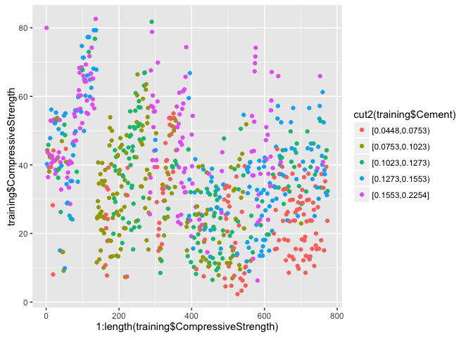

From left lower to right top corner, on the diagonal are `age`, `education`, `jobclass` and `y` (`wage`). You are looking for any data that shows a trend, on this case it seems there is a positive correlation between `education` and `wage` for example.

### Bi-Variate Plotting

We can look at a bi-dimensional relationship through simple qplot.


```r
qplot(age, wage, data=training)
```


It shows some correlation, but to the next question - why is there a cluster on the top of the plot?

### Multi Variate Plotting

Let's bring some color to the plot by adding a second regressor:


```r
qplot(age, wage, colour=jobclass, data=training)
```

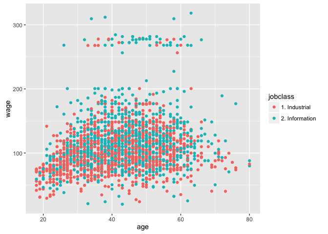

Many of the plots on the cluster seem to be on the 'information' job class, so that might explain a bit of the cluster.

We can also add regressor smoothers, a regression line for the second regressor on the plot, i.e.:


```r
qplot(age, wage, colour=education, data=training) +
    geom_smooth(method='lm', formula=y~x)
```

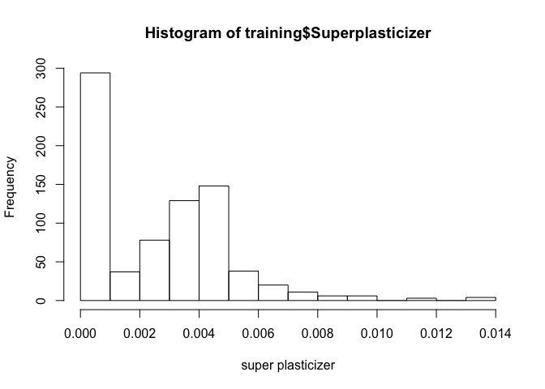

### Density Plots


```r
qplot(wage, colour=education, data=training, geom='density')
```


Shows that lot of people with less of HS education are concentrated under 100, and the highest concentration of advance degrees folks near 300.


### Making Factors

We can use factors, a factorized version of the continuous variable, to make it easier to look for patterns:


```r
library(Hmisc)
cutWage <- cut2(training$wage, g=3) # three quantile groups
table(cutWage)
```

```
## cutWage
## [ 20.1, 93.5) [ 93.5,118.9) [118.9,318.3] 
##           715           700           687
```


```r
qplot(cutWage, age, data=training, fill=cutWage, geom=c('boxplot'))
```


We can overlap boxplots with points (box plots hide extreme samples)


```r
library(gridExtra)
p1 <- qplot(cutWage, age, data=training, fill=cutWage, geom=c('boxplot'))
p2 <- qplot(cutWage, age, data=training, fill=cutWage, geom=c('boxplot', 'jitter'))
grid.arrange(p1, p2, ncol=2)
```

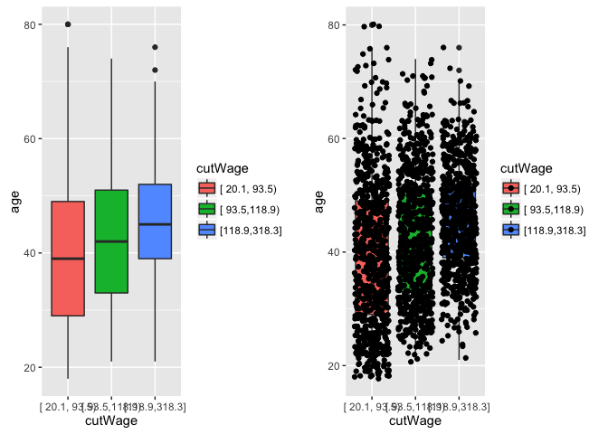

We can use tables with the cut (factorized) variable of the continuous variable, to look for patterns


```r
t1 <- table(cutWage, training$jobclass)
t1
```

```
##                
## cutWage         1. Industrial 2. Information
##   [ 20.1, 93.5)           447            268
##   [ 93.5,118.9)           352            348
##   [118.9,318.3]           284            403
```

It shows for example that there are less people on the information class for lower wages.

We can use `prop.table` for the proportion on each column (or row). For 1, uses proportion on each row.


```r
prop.table(t1, 1)
```

```
##                
## cutWage         1. Industrial 2. Information
##   [ 20.1, 93.5)     0.6251748      0.3748252
##   [ 93.5,118.9)     0.5028571      0.4971429
##   [118.9,318.3]     0.4133916      0.5866084
```

i.e. 62% of low wage jobs are industrial class and 38% are information class.

### Second Example: Concrete Strength


```r
library(AppliedPredictiveModeling); library(caret)
data(concrete)
summary(concrete)
```

```
##      Cement      BlastFurnaceSlag     FlyAsh           Water      
##  Min.   :102.0   Min.   :  0.0    Min.   :  0.00   Min.   :121.8  
##  1st Qu.:192.4   1st Qu.:  0.0    1st Qu.:  0.00   1st Qu.:164.9  
##  Median :272.9   Median : 22.0    Median :  0.00   Median :185.0  
##  Mean   :281.2   Mean   : 73.9    Mean   : 54.19   Mean   :181.6  
##  3rd Qu.:350.0   3rd Qu.:142.9    3rd Qu.:118.30   3rd Qu.:192.0  
##  Max.   :540.0   Max.   :359.4    Max.   :200.10   Max.   :247.0  
##  Superplasticizer CoarseAggregate  FineAggregate        Age        
##  Min.   : 0.000   Min.   : 801.0   Min.   :594.0   Min.   :  1.00  
##  1st Qu.: 0.000   1st Qu.: 932.0   1st Qu.:731.0   1st Qu.:  7.00  
##  Median : 6.400   Median : 968.0   Median :779.5   Median : 28.00  
##  Mean   : 6.205   Mean   : 972.9   Mean   :773.6   Mean   : 45.66  
##  3rd Qu.:10.200   3rd Qu.:1029.4   3rd Qu.:824.0   3rd Qu.: 56.00  
##  Max.   :32.200   Max.   :1145.0   Max.   :992.6   Max.   :365.00  
##  CompressiveStrength
##  Min.   : 2.33      
##  1st Qu.:23.71      
##  Median :34.45      
##  Mean   :35.82      
##  3rd Qu.:46.13      
##  Max.   :82.60
```


```r
set.seed(1000)
inTrain <- createDataPartition(mixtures$CompressiveStrength, p=3/4)[[1]]
training <- mixtures[inTrain,]
testing <- mixtures[-inTrain,]
```

#### Feature Plot


```r
featurePlot(x=training[,c('Cement','BlastFurnaceSlag','FlyAsh','Water')], y=training$CompressiveStrength, plot='pairs')
```

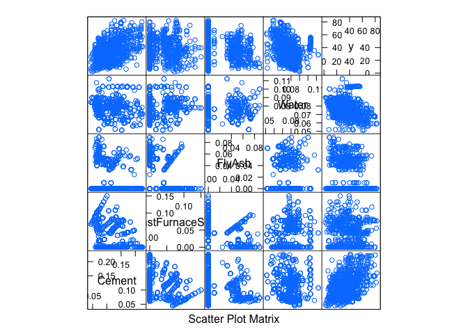

Cement is well correlated to strength.


```r
featurePlot(x=training[,c('Superplasticizer','CoarseAggregate','FineAggregate','Age')],
            y=training$CompressiveStrength, plot='pairs')
```

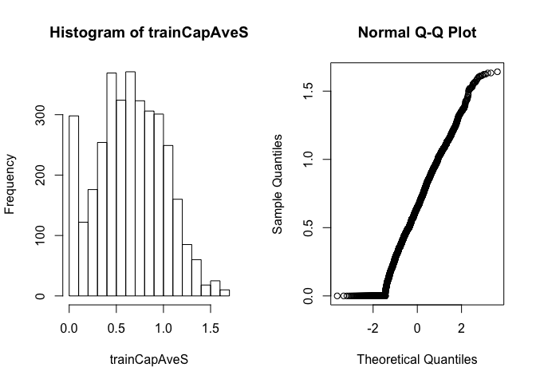

Course and fine aggregates are well correlated to strength.

#### Plot Outcome by one Regressor


```r
qplot(CompressiveStrength, FlyAsh, data=training) +
    geom_smooth(method='lm', formula=y~x)
```

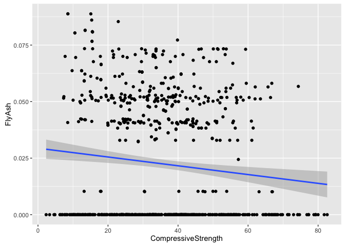

No correlation between FlyAsh and strength.

#### Plot Training by Index


```r
plot(training$CompressiveStrength, pch=19)
```

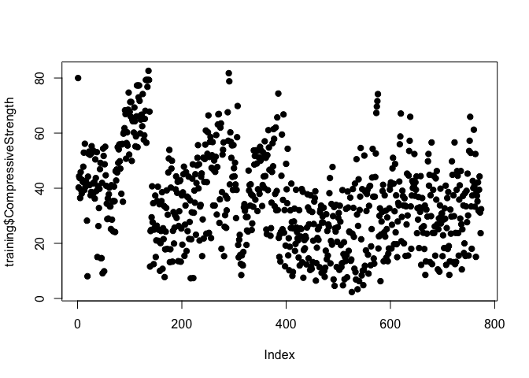

#### Plot Training by Index, Coloring on Regressors


```r
qplot(1:length(training$CompressiveStrength), training$CompressiveStrength, 
            col=cut2(training$Cement), data=training)
```


```r
qplot(1:length(training$CompressiveStrength), training$CompressiveStrength, 
            col=cut2(training$BlastFurnaceSlag), data=training)
```

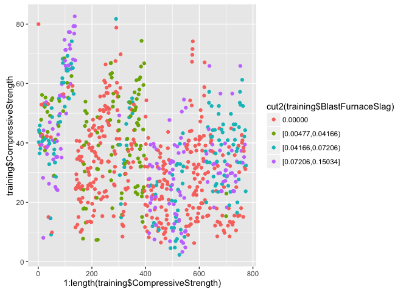

```r
qplot(1:length(training$CompressiveStrength), training$CompressiveStrength, 
            col=cut2(training$FlyAsh, g=2), data=training)
```

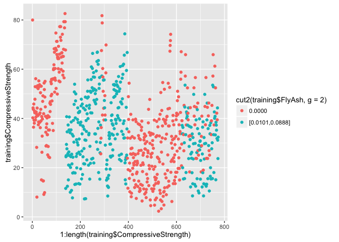

```r
qplot(1:length(training$CompressiveStrength), training$CompressiveStrength, 
            col=cut2(training$Water), data=training)
```

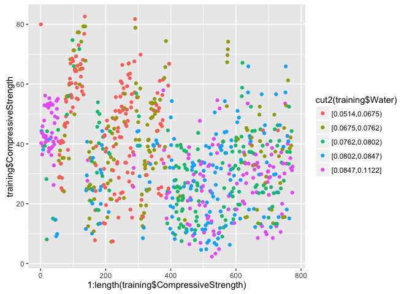


```r
qplot(1:length(training$CompressiveStrength), training$CompressiveStrength, 
            col=cut2(training$Superplasticizer), data=training)
```


```r
qplot(1:length(training$CompressiveStrength), training$CompressiveStrength, 
            col=cut2(training$CoarseAggregate), data=training)
```

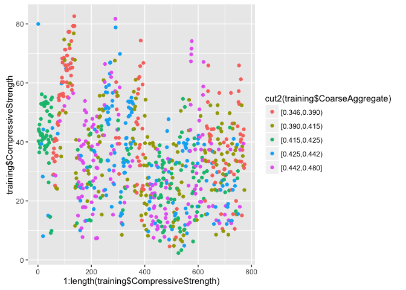

```r
qplot(1:length(training$CompressiveStrength), training$CompressiveStrength, 
            col=cut2(training$FineAggregate), data=training)
```

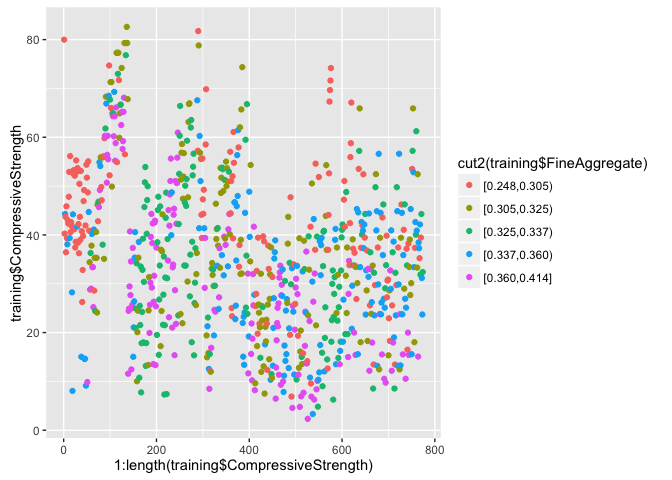

```r
qplot(1:length(training$CompressiveStrength), training$CompressiveStrength, 
            col=cut2(training$Age), data=training)
```

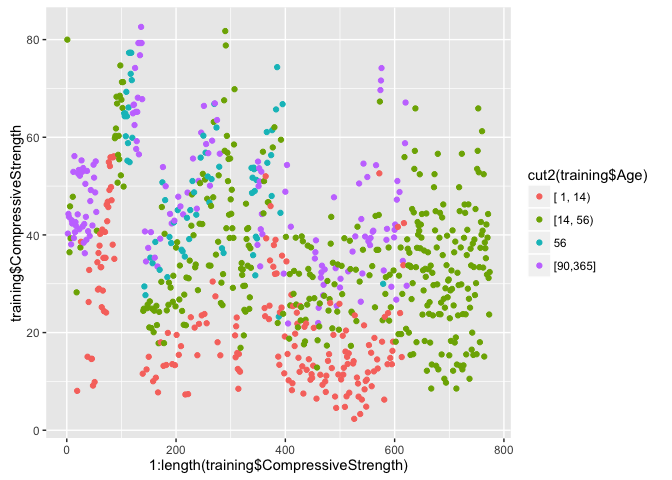

FlyAsh follows a bit the pattern of strength, but we cannot say it 'perfectly explains' the outcome vs index plot.

## Pre-Processing

### Why Pre-Processing


```r
library(AppliedPredictiveModeling); library(caret)
data(concrete)
set.seed(1000)
inTrain <- createDataPartition(mixtures$CompressiveStrength, p=3/4)[[1]]
training <- mixtures[inTrain,]
testing <- mixtures[-inTrain,]
```


```r
hist(training$Superplasticizer, xlab='super plasticizer')
```


The variable is skewed, and several values on zero. Would applying a log transform here would make it unskewed?


```r
hist(log10(training$Superplasticizer+1), xlab='super plasticizer log10 transformed')
```

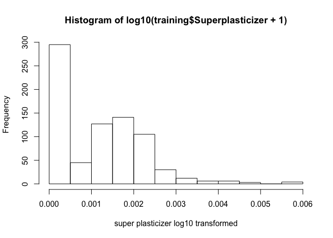

No. There are too many zeroes, so log transform does not unskew zero values.


```r
library(caret); library(e1071); library(kernlab)
data(spam)
inTrain <- createDataPartition(y=spam$type, p=0.75, list=FALSE)
training <- spam[inTrain,]
testing <- spam[-inTrain,]
```


```r
hist(training$capitalAve, xlab='average capital run length')
```

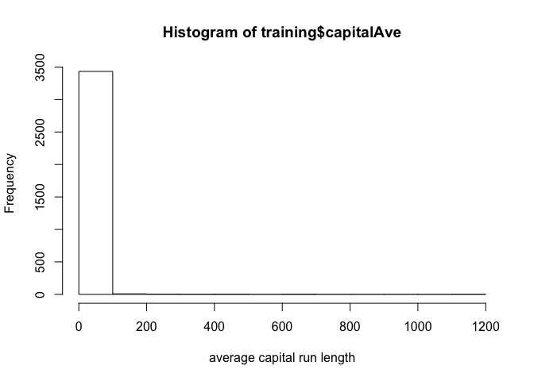

Absolute majority of the run length are small, but a few are much larger.


```r
c(mean(training$capitalAve), sd(training$capitalAve))
```

```
## [1]  5.180838 29.979038
```

Mean is low and values are skewed and highly variable. This will trick most ML algos.

### Standardizing


```r
trainCapAve <- training$capitalAve
trainCapAveS <- (trainCapAve - mean(trainCapAve))/sd(trainCapAve)
c(mean(trainCapAveS), sd(trainCapAveS))
```

```
## [1] -4.257002e-18  1.000000e+00
```

Standardized variables have $\mu = 0$ and $\sigma = 1$ on the training set.

**IMPORTANT** when you standardize a predictor in the training set, you have to manipulate the same predictor in the testing set as well, on a different formula:


```r
testCapAve <- testing$capitalAve
testCapAveS <- (testCapAve - mean(trainCapAve))/sd(trainCapAve)
c(mean(testCapAveS), sd(testCapAveS))
```

```
## [1] 0.001424955 1.217384985
```

Standardization on the test set is calculated with mean and standard deviation of the training set. As a consequence standardization of variables on the test set have $\mu \neq 0$ and $\sigma \neq 1$ (but hopefully they will be close enough).

We can use the `preProcess` function to take care of all details:


```r
preObj <- preProcess(training[,-58], method=c('center','scale')) # all variables in training except the outcome
trainCapAveS <- predict(preObj, training[,-58])$capitalAve
```


```r
c(mean(trainCapAveS), sd(trainCapAveS))
```

```
## [1] -4.257002e-18  1.000000e+00
```

We can use the resulting pre-processed object `preObj` to predict an outcome on the testing dataset, i.e.


```r
testCapAveS <- predict(preObj, training[,-58])$capitalAve
c(mean(testCapAveS), sd(testCapAveS))
```

```
## [1] -4.257002e-18  1.000000e+00
```

Again, standardization of variables on the test set have $\mu \neq 0$ and $\sigma \neq 1$ even when using `preProcess`.

We can pre-process predictors during the `train` phase by using the `preProcess` argument:


```r
set.seed(32343)
modelFit <- train(type ~ ., data=training, method='glm', preProcess=c('center','scale'))
modelFit
```

```
## Generalized Linear Model 
## 
## 3451 samples
##   57 predictor
##    2 classes: 'nonspam', 'spam' 
## 
## Pre-processing: centered (57), scaled (57) 
## Resampling: Bootstrapped (25 reps) 
## Summary of sample sizes: 3451, 3451, 3451, 3451, 3451, 3451, ... 
## Resampling results
## 
##   Accuracy  Kappa      Accuracy SD  Kappa SD  
##   0.922388  0.8363122  0.007182872  0.01453939
## 
## 
```

### Box-Cox Transformations

This is a useful data transformation technique used to stabilize variance, make the data more normal distribution-like and for other data stabilization procedures.


```r
preObj <- preProcess(training[,-58], method=c('BoxCox')) # all variables in training except the outcome
trainCapAveS <- predict(preObj, training[,-58])$capitalAve
par(mfrow=c(1,2)); hist(trainCapAveS); qqnorm(trainCapAveS)
```

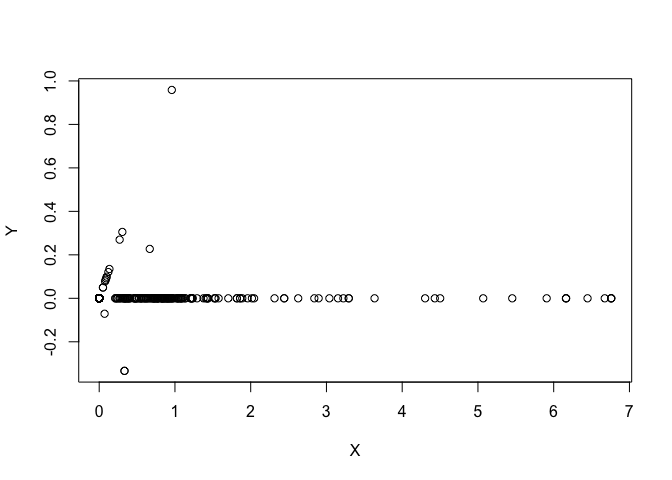

you can see that there is still a large number of samples on the lower bound of the histogram, as well as the QQ plot is not entirelly linear.

### Imputing Data

Using K nearest neighbors imputation. Takes an average of the K closest matches to a missing value and replace that missing value by that average.


```r
library(RANN)
set.seed(13343)
# make some NA values, so we can something to impute
training$capAve <- training$capitalAve
selectNA <- rbinom(dim(training)[1], size=1, prob=0.05) == 1
training$capAve[selectNA] <- NA
# impute and standardize
preObj <- preProcess(training[,-58], method='knnImpute') # all variables in training except the outcome
capAve <- predict(preObj, training[,-58])$capAve
# standardize true values
capAveTruth <- training$capitalAve
capAveTruth <- (capAveTruth - mean(capAveTruth))/sd(capAveTruth)
```


```r
quantile(capAve - capAveTruth)
```

```
##            0%           25%           50%           75%          100% 
## -0.4648044369  0.0001057534  0.0007786010  0.0010934429  1.8216236106
```


```r
quantile((capAve - capAveTruth)[selectNA])
```

```
##            0%           25%           50%           75%          100% 
## -0.3112099676 -0.0167811049  0.0009838407  0.0193472829  1.8216236106
```


```r
quantile((capAve - capAveTruth)[!selectNA])
```

```
##            0%           25%           50%           75%          100% 
## -0.4648044369  0.0001554764  0.0007786010  0.0010756696  0.0013223803
```

## Covariate Creation

$Covariate = Predictors = Features$

* Level 1: from raw -> covariate
* Level 2: transforming tidy covariates (e.g. `aSquare <- a^2`)


```r
library(ISLR); library(ggplot2); library(caret)
data(Wage)
inTrain <- createDataPartition(y=Wage$wage, p=0.7, list=FALSE)
training <- Wage[inTrain,]
testing <- Wage[-inTrain,]
```

### Dummy Variables

Convert factor variables to indicator variables


```r
table(training$jobclass)
```

```
## 
##  1. Industrial 2. Information 
##           1051           1051
```

These are string, prediction algorithms deal horribly with qualitative variables. Let's transform them into quantitative variables.


```r
dummies <- dummyVars(wage ~ jobclass, data=training)
head(predict(dummies,newdata=training))
```

```
##        jobclass.1. Industrial jobclass.2. Information
## 86582                       0                       1
## 161300                      1                       0
## 155159                      0                       1
## 11443                       0                       1
## 376662                      0                       1
## 450601                      1                       0
```

You can see 0s and 1s indicating when a row is industrial and information, similar to a bit mask.

### Removing Zero Variability Covariates

To remove regressors that have a very low variability so they might not be good predictors


```r
nsv <- nearZeroVar(training, saveMetrics=TRUE)
nsv
```

```
##            freqRatio percentUnique zeroVar   nzv
## year        1.037356    0.33301618   FALSE FALSE
## age         1.027027    2.85442436   FALSE FALSE
## sex         0.000000    0.04757374    TRUE  TRUE
## maritl      3.272931    0.23786870   FALSE FALSE
## race        8.938776    0.19029496   FALSE FALSE
## education   1.389002    0.23786870   FALSE FALSE
## region      0.000000    0.04757374    TRUE  TRUE
## jobclass    1.000000    0.09514748   FALSE FALSE
## health      2.468647    0.09514748   FALSE FALSE
## health_ins  2.352472    0.09514748   FALSE FALSE
## logwage     1.061728   19.17221694   FALSE FALSE
## wage        1.061728   19.17221694   FALSE FALSE
```

For each line the algo calculates a percentage of unique values `percentUnique` and frequency ratio `freqRatio`. We can see that a few covariates are considered less relevant due to low variability: `sex`, `region`, etc.

### Spline Basis Functions

One other way is to use a line to find regressors associated to orders of a polynomial function, i.e.:


```r
library(splines)
bsBasis <- bs(training$age, df=3) # third degree polynomial variables
head(bsBasis)
```

```
##              1          2           3
## [1,] 0.2368501 0.02537679 0.000906314
## [2,] 0.4163380 0.32117502 0.082587862
## [3,] 0.4308138 0.29109043 0.065560908
## [4,] 0.3625256 0.38669397 0.137491189
## [5,] 0.3063341 0.42415495 0.195763821
## [6,] 0.4241549 0.30633413 0.073747105
```

Where:

* column 1: $age$, scaled for computational purposes
* column 2: $age^2$, scaled, a quadratic relationship between age and the outcome
* column 3: $age^3$, scaled, a cubic relationship between age and the outcome

If you add these 3 covariates to the model you add 3 covariates that will allow for a curvy model fitting:


```r
lm1 <- lm(wage ~ bsBasis, data=training)
plot(training$age, training$wage, pch=19, cex=0.5)
points(training$age, predict(lm1, newdata=training), col='red', pch=19, cex=0.5)
```


To predict on the test data set:


```r
p <- predict(bsBasis, age=testing$age)
head(p)
```

```
##              1          2           3
## [1,] 0.2368501 0.02537679 0.000906314
## [2,] 0.4163380 0.32117502 0.082587862
## [3,] 0.4308138 0.29109043 0.065560908
## [4,] 0.3625256 0.38669397 0.137491189
## [5,] 0.3063341 0.42415495 0.195763821
## [6,] 0.4241549 0.30633413 0.073747105
```

## Preprocessing with Principal Component Analysis


```r
library(caret); library(e1071); library(kernlab)
data(spam)
inTrain <- createDataPartition(y=spam$type, p=0.75, list=FALSE)
training <- spam[inTrain,]
testing <- spam[-inTrain,]
```

Extracting all features with a correlation greater than 0.8:


```r
M <- abs(cor(training[,-58])) # matrix of correlations between all features (outcome excluded)
diag(M) <- 0 # diagonal would be 1, making it 0
which(M > 0.8, arr.ind=T)
```

```
##        row col
## num415  34  32
## direct  40  32
## num857  32  34
## direct  40  34
## num857  32  40
## num415  34  40
```

Some of the features of high correlation are `num415` and `num857`


```r
names(spam)[c(34,32)]
```

```
## [1] "num415" "num857"
```


```r
plot(spam[,34],spam[,32])
```

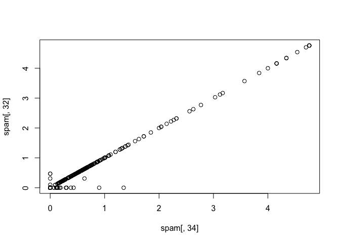

They lay on a line, so are highly correlated.

One way we could save on the number of predictors would be to rotate the plot


```r
X <- 0.71*training$num415 + 0.71*training$num857
Y <- 0.71*training$num415 - 0.71*training$num857
plot(X, Y)
```

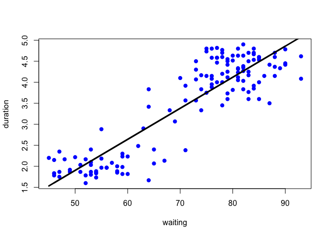

You could get to the same exact results by PCA:


```r
smallSpam <- spam[,c(34,32)]
prComp <- prcomp(smallSpam)
plot(prComp$x[,1], prComp$x[,2])
```


Rotation matrix shows the exact coefficients used to obtain the principal components:


```r
prComp$rotation
```

```
##              PC1        PC2
## num415 0.7080625  0.7061498
## num857 0.7061498 -0.7080625
```

Doing PCA on SPAM data. If we were to plot only the first and second more important principal components


```r
typeColor <- ((spam$type=='spam')*1 + 1) # black for spam red otherwise
prComp <- prcomp(log10(spam[,-58]+1)) # using log to make it more gaussian looking, all features
plot(prComp$x[,1], prComp$x[,2], col=typeColor, xlab='PC1', ylab='PC2')
```


We can see PC1 explains a lot of spam/mospam (above a certain threshold there is change from black to red)

We can pre-process using PCA as well:


```r
preProc <- preProcess(log10(spam[,-58]+1), method='pca', pcaComp=2) # use 2 components only
spamPC <- predict(preProc, log10(spam[,-58]+1))
plot(spamPC[,1], spamPC[,2], col=typeColor)
```

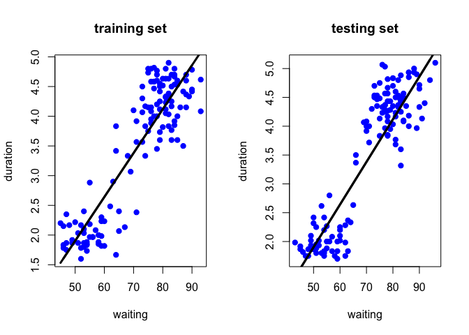

And we can use the result to train a model, say `glm`.


```r
preProc <- preProcess(log10(training[,-58]+1), method='pca', pcaComp=2) # use 2 components only
trainPC <- predict(preProc, log10(training[,-58]+1))
modelFit <- train(training$type ~ ., method='glm', data=trainPC)
```

And check the accuracy using a confusion matrix:


```r
testPC <- predict(preProc, log10(testing[,-58]+1))
confusionMatrix(testing$type, predict(modelFit, testPC))
```

```
## Confusion Matrix and Statistics
## 
##           Reference
## Prediction nonspam spam
##    nonspam     645   52
##    spam         73  380
##                                           
##                Accuracy : 0.8913          
##                  95% CI : (0.8719, 0.9087)
##     No Information Rate : 0.6243          
##     P-Value [Acc > NIR] : < 2e-16         
##                                           
##                   Kappa : 0.7705          
##  Mcnemar's Test P-Value : 0.07364         
##                                           
##             Sensitivity : 0.8983          
##             Specificity : 0.8796          
##          Pos Pred Value : 0.9254          
##          Neg Pred Value : 0.8389          
##              Prevalence : 0.6243          
##          Detection Rate : 0.5609          
##    Detection Prevalence : 0.6061          
##       Balanced Accuracy : 0.8890          
##                                           
##        'Positive' Class : nonspam         
## 
```

Or you can use `train`, with `preProcess='pca'`, to adjust components and train in one shot


```r
modelFit <- train(training$type ~ ., method='glm', data=training, preProcess='pca')
confusionMatrix(testing$type, predict(modelFit, testing))
```

```
## Confusion Matrix and Statistics
## 
##           Reference
## Prediction nonspam spam
##    nonspam     658   39
##    spam         50  403
##                                           
##                Accuracy : 0.9226          
##                  95% CI : (0.9056, 0.9374)
##     No Information Rate : 0.6157          
##     P-Value [Acc > NIR] : <2e-16          
##                                           
##                   Kappa : 0.8372          
##  Mcnemar's Test P-Value : 0.2891          
##                                           
##             Sensitivity : 0.9294          
##             Specificity : 0.9118          
##          Pos Pred Value : 0.9440          
##          Neg Pred Value : 0.8896          
##              Prevalence : 0.6157          
##          Detection Rate : 0.5722          
##    Detection Prevalence : 0.6061          
##       Balanced Accuracy : 0.9206          
##                                           
##        'Positive' Class : nonspam         
## 
```

Problems can be stated the other way around, e.g. how many components are needed to achieve X% accuracy (threshold)? for example: on alzheimers dataset, using only predictors that begin with IL, what is the number of principal components needed to capture 90% of the variance?


```r
library(caret)
library(AppliedPredictiveModeling)
set.seed(3433)
data(AlzheimerDisease)
adData = data.frame(diagnosis,predictors)
inTrain = createDataPartition(adData$diagnosis, p = 3/4)[[1]]
training = adData[ inTrain,]
testing = adData[-inTrain,]
```

```r
subset <- training[,grep("^IL", names(training))]
preProcess(subset, method='pca', thresh=0.9)$numComp
```

```
## [1] 9
```

More specifically:


```r
preProcess(subset, method='pca', thresh=0.9)$rotation
```

```
##                       PC1           PC2           PC3          PC4
## IL_11         -0.06529786  0.5555956867  0.2031317937 -0.050389599
## IL_13          0.27529157  0.3559427297 -0.0399010765  0.265076920
## IL_16          0.42079000  0.0007224953  0.0832211446 -0.082097273
## IL_17E        -0.01126118  0.5635958176  0.3744707126  0.302512329
## IL_1alpha      0.25078195 -0.0687043488 -0.3008366900  0.330945942
## IL_3           0.42026485 -0.0703352892 -0.1049647272 -0.065352774
## IL_4           0.33302031  0.0688495706 -0.1395450144  0.165631691
## IL_5           0.38706503 -0.0039619980  0.0005616126 -0.224448981
## IL_6           0.05398185 -0.4248425653  0.6090821756  0.417591202
## IL_6_Receptor  0.21218980  0.1005338329  0.2920341087 -0.659953479
## IL_7           0.32948731  0.0806070090 -0.1966471906  0.165544952
## IL_8           0.29329723 -0.1883039842  0.4405255221  0.002811187
##                       PC5          PC6         PC7         PC8
## IL_11          0.73512798 -0.102014559  0.20984151 -0.08402367
## IL_13         -0.25796332 -0.068927711  0.58942516 -0.06839401
## IL_16          0.04435883 -0.007094672 -0.06581741  0.02665034
## IL_17E        -0.38918707  0.221149380 -0.46462692  0.02185290
## IL_1alpha      0.16992452  0.742391473  0.12787035 -0.19555207
## IL_3           0.02352819 -0.165587911 -0.09006656 -0.15062164
## IL_4          -0.14268797 -0.297421293  0.19661173  0.57346657
## IL_5           0.08426042  0.153835977 -0.16425757 -0.02917286
## IL_6          -0.00165066 -0.166089521  0.21895103 -0.34568186
## IL_6_Receptor -0.29654048  0.138000448  0.22657846 -0.26274531
## IL_7           0.11373532 -0.405698338 -0.42065832 -0.40841984
## IL_8           0.28608600  0.184321013 -0.14833779  0.49101347
##                        PC9
## IL_11          0.183359387
## IL_13         -0.512677898
## IL_16         -0.225338083
## IL_17E         0.117769681
## IL_1alpha      0.256874424
## IL_3           0.014565029
## IL_4           0.591849422
## IL_5           0.003418637
## IL_6           0.221816813
## IL_6_Receptor  0.276527746
## IL_7           0.002607462
## IL_8          -0.311002624
```

Another use is to compare models and their accuracy. For example, using only predictors with variable names beginning with IL and diagnosis as outcome:


```r
set.seed(3433)
ilColumns <- grep("^IL", names(training), value=TRUE)
df <- data.frame(diagnosis, predictors[, ilColumns])
inTrain = createDataPartition(df$diagnosis, p = 3/4)[[1]]
training = df[ inTrain,]
testing = df[-inTrain,]
```

Build two predictive models. One using the predictors as they are (no PCA):


```r
modelFit <- train(diagnosis ~ ., method = "glm", data = training)
predictions <- predict(modelFit, newdata = testing)
cm1 <- confusionMatrix(predictions, testing$diagnosis)
print(cm1)
```

```
## Confusion Matrix and Statistics
## 
##           Reference
## Prediction Impaired Control
##   Impaired        2       9
##   Control        20      51
##                                          
##                Accuracy : 0.6463         
##                  95% CI : (0.533, 0.7488)
##     No Information Rate : 0.7317         
##     P-Value [Acc > NIR] : 0.96637        
##                                          
##                   Kappa : -0.0702        
##  Mcnemar's Test P-Value : 0.06332        
##                                          
##             Sensitivity : 0.09091        
##             Specificity : 0.85000        
##          Pos Pred Value : 0.18182        
##          Neg Pred Value : 0.71831        
##              Prevalence : 0.26829        
##          Detection Rate : 0.02439        
##    Detection Prevalence : 0.13415        
##       Balanced Accuracy : 0.47045        
##                                          
##        'Positive' Class : Impaired       
## 
```

And one using PCA with principal components explaining 80% of the variance in the predictors. Use method="glm" in the train function:


```r
modelFit <- train(training$diagnosis ~ ., method = "glm", preProcess = "pca", data = training, 
                  trControl = trainControl(preProcOptions = list(thresh = 0.8)))
cm2 <- confusionMatrix(testing$diagnosis, predict(modelFit, testing))
print(cm2)
```

```
## Confusion Matrix and Statistics
## 
##           Reference
## Prediction Impaired Control
##   Impaired        3      19
##   Control         4      56
##                                           
##                Accuracy : 0.7195          
##                  95% CI : (0.6094, 0.8132)
##     No Information Rate : 0.9146          
##     P-Value [Acc > NIR] : 1.000000        
##                                           
##                   Kappa : 0.0889          
##  Mcnemar's Test P-Value : 0.003509        
##                                           
##             Sensitivity : 0.42857         
##             Specificity : 0.74667         
##          Pos Pred Value : 0.13636         
##          Neg Pred Value : 0.93333         
##              Prevalence : 0.08537         
##          Detection Rate : 0.03659         
##    Detection Prevalence : 0.26829         
##       Balanced Accuracy : 0.58762         
##                                           
##        'Positive' Class : Impaired        
## 
```

What are the accuracies on each model?


```r
c(cm1$overall[1], cm2$overall[1])
```

```
##  Accuracy  Accuracy 
## 0.6463415 0.7195122
```


## Predicting with Regression: Single Covariate

### Example: Old Faithful

Predicting eruption time and duration of the "old faithful" geiser:


```r
library(caret); data("faithful"); set.seed(333)
inTrain <- createDataPartition(y=faithful$waiting, p=0.5, list=FALSE)
trainFaith <- faithful[inTrain,]; testFaith <- faithful[-inTrain,]
head(trainFaith)
```

```
##   eruptions waiting
## 1     3.600      79
## 3     3.333      74
## 5     4.533      85
## 6     2.883      55
## 7     4.700      88
## 8     3.600      85
```

We will fit a linear model on the following equation:

$ED_i = b_0 + b_1 WT_i + e_i$

Where $ED_i$ is `eruptions` (the outcome), $WT_i$ is `waiting` (the regressor) and `e` is error at time $i$.


```r
lm1 <- lm(eruptions ~ waiting, data=trainFaith)
summary(lm1)
```

```
## 
## Call:
## lm(formula = eruptions ~ waiting, data = trainFaith)
## 
## Residuals:
##      Min       1Q   Median       3Q      Max 
## -1.26990 -0.34789  0.03979  0.36589  1.05020 
## 
## Coefficients:
##              Estimate Std. Error t value Pr(>|t|)    
## (Intercept) -1.792739   0.227869  -7.867 1.04e-12 ***
## waiting      0.073901   0.003148  23.474  < 2e-16 ***
## ---
## Signif. codes:  0 '***' 0.001 '**' 0.01 '*' 0.05 '.' 0.1 ' ' 1
## 
## Residual standard error: 0.495 on 135 degrees of freedom
## Multiple R-squared:  0.8032,	Adjusted R-squared:  0.8018 
## F-statistic:   551 on 1 and 135 DF,  p-value: < 2.2e-16
```

On these results, $b_0 = -1.792739$ and $b_1 = 0.073901$. Visually, the fitted linear model looks something like this:


```r
plot(trainFaith$waiting, trainFaith$eruptions, pch=19, col='blue', xlab='waiting', ylab='duration')
lines(trainFaith$waiting, lm1$fitted, lwd=3)
```


You can get to the same results using `train` with `method='lm'`:


```r
modFit <- train(eruptions ~ waiting, data=trainFaith, method='lm')
summary(modFit$finalModel)
```

```
## 
## Call:
## lm(formula = .outcome ~ ., data = dat)
## 
## Residuals:
##      Min       1Q   Median       3Q      Max 
## -1.26990 -0.34789  0.03979  0.36589  1.05020 
## 
## Coefficients:
##              Estimate Std. Error t value Pr(>|t|)    
## (Intercept) -1.792739   0.227869  -7.867 1.04e-12 ***
## waiting      0.073901   0.003148  23.474  < 2e-16 ***
## ---
## Signif. codes:  0 '***' 0.001 '**' 0.01 '*' 0.05 '.' 0.1 ' ' 1
## 
## Residual standard error: 0.495 on 135 degrees of freedom
## Multiple R-squared:  0.8032,	Adjusted R-squared:  0.8018 
## F-statistic:   551 on 1 and 135 DF,  p-value: < 2.2e-16
```

We got to pretty much the same results, $b_0 = -1.792739$ (Intercept) and $b_1 = 0.073901$. (waiting).

To predict a new value we use estimated outcomes/regressors, denoted by a little 'hat' over the variables on the previous equation:

$\hat {ED_i} = \hat {b_0} + \hat {b_1} WT_i$

For example, what should "eruption"" time be for a waiting time of 80?


```r
coef(lm1)[1] + coef(lm1)[2]*80 
```

```
## (Intercept) 
##    4.119307
```

Same thing, using `predict`:


```r
predict(lm1, data.frame(waiting=80))
```

```
##        1 
## 4.119307
```

### Plotting Training vs Testing


```r
par(mfrow=c(1,2))
plot(trainFaith$waiting, trainFaith$eruptions, pch=19, col='blue', xlab='waiting', ylab='duration', 
     main='training set')
lines(trainFaith$waiting, predict(lm1),lwd=3)
plot(testFaith$waiting, testFaith$eruptions, pch=19, col='blue', xlab='waiting', ylab='duration', 
     main='testing set')
lines(testFaith$waiting, predict(lm1, newdata=testFaith),lwd=3)
```


Doesn't perfectly fit the training set, but it is a pretty good approximation for predictions on the testing set.

### Calculating Training and Testing Sets Errors

Root mean squared errors (RMSE) on training:


```r
sqrt(sum((lm1$fitted - trainFaith$eruptions)^2))
```

```
## [1] 5.75186
```

RMSE on test:


```r
sqrt(sum((predict(lm1, newdata=testFaith) - testFaith$eruptions)^2))
```

```
## [1] 5.838559
```

About the same, but of course the error on testing set is higher.

### Prediction Intervals

Parameter `interval='prediction'` tells `predict` to generate a prediction interval:


```r
pred1 <- predict(lm1, newdata=testFaith, interval='prediction') 
ord <- order(testFaith$waiting)
plot(testFaith$waiting, testFaith$eruptions, pch=19, col='blue') # test data predictor vs outcome
matlines(testFaith$waiting[ord], pred1[ord,], type='l',col=c(1,2,2),lty=c(1,1,1),lwd=2)
```

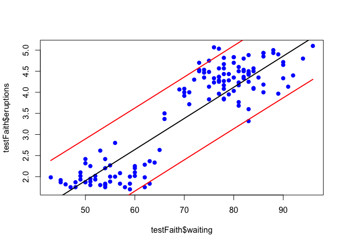

## Predicting with Regression: Multiple Covariates

### Example: Wages

Partitioning the Wage dataset again, 70/30 between training and testing data sets:


```r
library(ISLR); library(ggplot2); library(caret)
data(Wage)
inTrain <- createDataPartition(y=Wage$wage, p=0.7, list=FALSE)
training <- Wage[inTrain,]
testing <- Wage[-inTrain,]
```


```r
dim(training)
```

```
## [1] 2102   12
```


```r
dim(testing)
```

```
## [1] 898  12
```

### Fitting Linear Models

A linear model for multiple regressors would look something like this:

$wage_i = b_0 + b_1 age + b_2 I(jobclass='Information') + \sum_{k=1}^{4} \gamma_k I(education_i = level_k)$

where $b_0$ is the intercept, and $b_1$,  $b_2$ are the coefficients for age and a transformation of jobclass='Information' is 1, 0 otherwise. For $\gamma_k$, it is the coefficients of all educations from 1 to 4, when education = level is 1, 0 otherwise.

In the formula `wage ~ age + jobclass + education`, since `jobclass` and `education` are factors, it automatically (nice!) does the transformations for indicator function $I(k)$ where k is factor, described above.


```r
modFit <- train(wage ~ age + jobclass + education, method='lm', data=training)
print(modFit)
```

```
## Linear Regression 
## 
## 2102 samples
##   11 predictor
## 
## No pre-processing
## Resampling: Bootstrapped (25 reps) 
## Summary of sample sizes: 2102, 2102, 2102, 2102, 2102, 2102, ... 
## Resampling results
## 
##   RMSE      Rsquared  RMSE SD   Rsquared SD
##   36.43771  0.267012  1.281502  0.01740793 
## 
## 
```

You can see we have 10 predictors, one for age, 2+1 for jobclass and 5+1 for education, where +1 is the predictor for no factor selected (created by default).

### Diagnostic Plots

We use diagnostic plots to get some insight into wether or not our model is missing important predictors.

#### Residual Plots


```r
finMod <- modFit$finalModel
plot(finMod, 1, pch=19, cex=0.5, col='#00000010')
```


Is the residuals vs fitted plot. We want to see a straight line on residuals=0 (what is not, for higher fitted values) and small number of outliers (what we are not seeing, look at the numbers on the top).

#### Plot by Variables Missing on Initial Model

We can also color by variables not used in the original model:


```r
qplot(finMod$fitted, finMod$residuals, col=race, data=training)
```

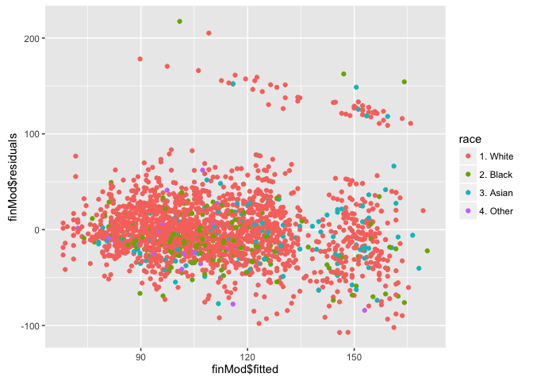

We can see that several outliers are related to race (white race), indicating that race is a potential missing regressor.

#### Plot by Index

Index is just the position of a sample on the dataset.


```r
plot(finMod$residuals, pch=19)
```

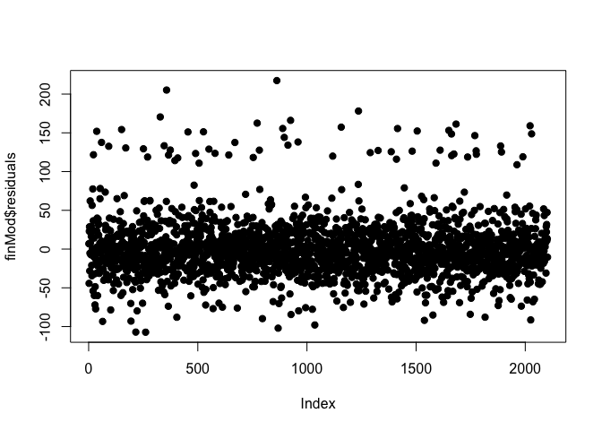

We can see a clear trend, residuals grow with index. Also more outliers as index grow (right side of the plot). This indicates a potential regressor is missing in our model, usually related to some time related continous variable (age, date, timestamp, etc.)


### Predicited vs Truth in Test Set

This is a post-mortem analysis, do not go back to your model and change it based on what you find here (big chances of overfitting if you do so)


```r
pred <- predict(modFit, testing)
qplot(wage, pred, col=year, data=testing)
```

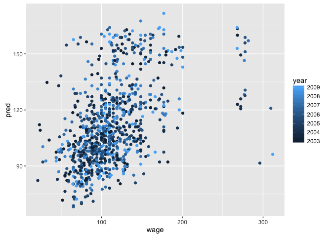

You are looking for a linear, 45 degrees fitted line between predicted and truth, no outliers. You add color to find a variable that might be potentially impeding that linear relationship from occuring.

### Including all the Variables


```r
modFitAll <- train(wage ~ ., method='lm', data=training)
print(modFitAll)
```

```
## Linear Regression 
## 
## 2102 samples
##   11 predictor
## 
## No pre-processing
## Resampling: Bootstrapped (25 reps) 
## Summary of sample sizes: 2102, 2102, 2102, 2102, 2102, 2102, ... 
## Resampling results
## 
##   RMSE      Rsquared   RMSE SD    Rsquared SD
##   12.48925  0.9108799  0.7653664  0.005605719
## 
## 
```

We can see we are doing better, RMSE dropped from **36.43771** to **12.48925** for example.


```r
pred <- predict(modFitAll, testing)
qplot(wage, pred, data=testing)
```

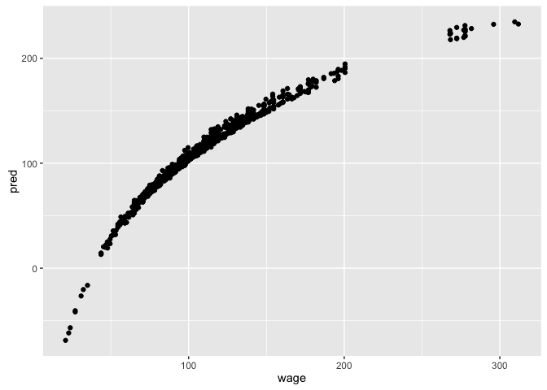

