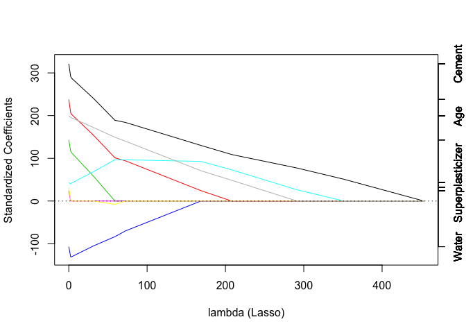
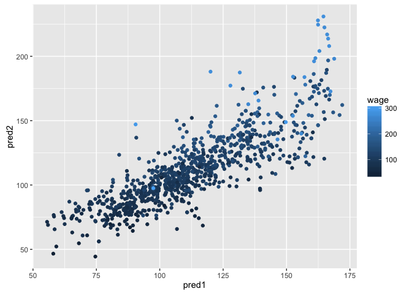
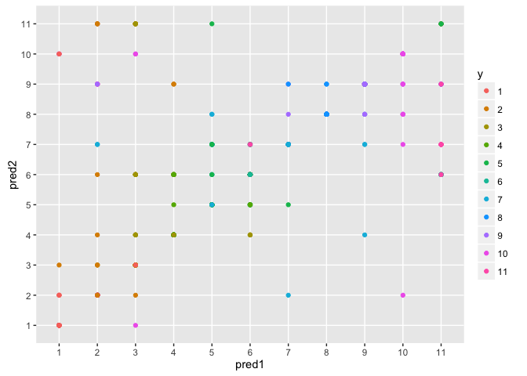
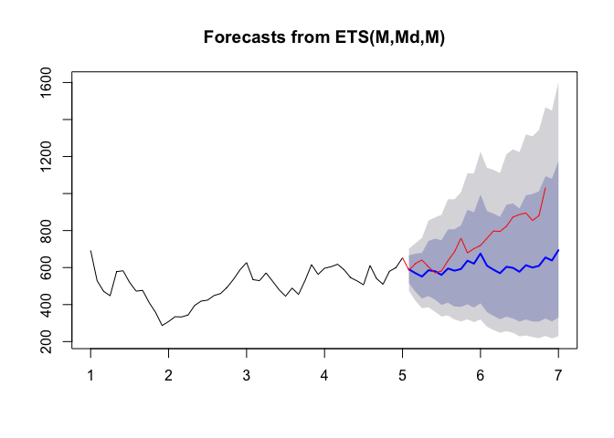

# Machine Learning: Regularized Regressions and Combining Predictors
J Faleiro  
April 28, 2015  

# Required libraries


```r
if (!require("pacman")) install.packages("pacman")
pacman::p_load(ElemStatLearn, ISLR, ggplot2, caret, quantmod, plyr, dplyr, forecast, 
               elasticnet, lubridate, e1071)
```

# Regularized Regression

## Example: Prostate Cancer


```r
library(ElemStatLearn)
data(prostate)
str(prostate)
```

```
## 'data.frame':	97 obs. of  10 variables:
##  $ lcavol : num  -0.58 -0.994 -0.511 -1.204 0.751 ...
##  $ lweight: num  2.77 3.32 2.69 3.28 3.43 ...
##  $ age    : int  50 58 74 58 62 50 64 58 47 63 ...
##  $ lbph   : num  -1.39 -1.39 -1.39 -1.39 -1.39 ...
##  $ svi    : int  0 0 0 0 0 0 0 0 0 0 ...
##  $ lcp    : num  -1.39 -1.39 -1.39 -1.39 -1.39 ...
##  $ gleason: int  6 6 7 6 6 6 6 6 6 6 ...
##  $ pgg45  : int  0 0 20 0 0 0 0 0 0 0 ...
##  $ lpsa   : num  -0.431 -0.163 -0.163 -0.163 0.372 ...
##  $ train  : logi  TRUE TRUE TRUE TRUE TRUE TRUE ...
```


```r
covnames <- names(prostate[-(9:10)])
y <- prostate$lpsa
x <- prostate[,covnames]

form <- as.formula(paste("lpsa~", paste(covnames, collapse="+"), sep=""))
summary(lm(form, data=prostate[prostate$train,]))
```

```
## 
## Call:
## lm(formula = form, data = prostate[prostate$train, ])
## 
## Residuals:
##      Min       1Q   Median       3Q      Max 
## -1.64870 -0.34147 -0.05424  0.44941  1.48675 
## 
## Coefficients:
##              Estimate Std. Error t value Pr(>|t|)    
## (Intercept)  0.429170   1.553588   0.276  0.78334    
## lcavol       0.576543   0.107438   5.366 1.47e-06 ***
## lweight      0.614020   0.223216   2.751  0.00792 ** 
## age         -0.019001   0.013612  -1.396  0.16806    
## lbph         0.144848   0.070457   2.056  0.04431 *  
## svi          0.737209   0.298555   2.469  0.01651 *  
## lcp         -0.206324   0.110516  -1.867  0.06697 .  
## gleason     -0.029503   0.201136  -0.147  0.88389    
## pgg45        0.009465   0.005447   1.738  0.08755 .  
## ---
## Signif. codes:  0 '***' 0.001 '**' 0.01 '*' 0.05 '.' 0.1 ' ' 1
## 
## Residual standard error: 0.7123 on 58 degrees of freedom
## Multiple R-squared:  0.6944,	Adjusted R-squared:  0.6522 
## F-statistic: 16.47 on 8 and 58 DF,  p-value: 2.042e-12
```


```r
set.seed(1)
train.ind <- sample(nrow(prostate), ceiling(nrow(prostate))/2)
y.test <- prostate$lpsa[-train.ind]
x.test <- x[-train.ind,]

y <- prostate$lpsa[train.ind]
x <- x[train.ind,]

p <- length(covnames)
rss <- list()
for (i in 1:p) {
  cat(i)
  Index <- combn(p,i)

  rss[[i]] <- apply(Index, 2, function(is) {
    form <- as.formula(paste("y~", paste(covnames[is], collapse="+"), sep=""))
    isfit <- lm(form, data=x)
    yhat <- predict(isfit)
    train.rss <- sum((y - yhat)^2)

    yhat <- predict(isfit, newdata=x.test)
    test.rss <- sum((y.test - yhat)^2)
    c(train.rss, test.rss)
  })
}
```

```
## 12345678
```

Plotting of residuals by number of predictors:


```r
plot(1:p, 1:p, type="n", ylim=range(unlist(rss)), xlim=c(0,p), xlab="number of predictors", ylab="residual sum of squares", main="Prostate cancer data")
for (i in 1:p) {
  points(rep(i-0.15, ncol(rss[[i]])), rss[[i]][1, ], col="blue")
  points(rep(i+0.15, ncol(rss[[i]])), rss[[i]][2, ], col="red")
}
minrss <- sapply(rss, function(x) min(x[1,]))
lines((1:p)-0.15, minrss, col="blue", lwd=1.7)
minrss <- sapply(rss, function(x) min(x[2,]))
lines((1:p)+0.15, minrss, col="red", lwd=1.7)
legend("topright", c("Train", "Test"), col=c("blue", "red"), pch=1)
```

<!-- -->

A few important observations:

* The training set error (residuals) always goes down as we increase the number of predictors

* As we increase the number of predictors, residuals on the test set go down and them up - this is an indication of a model overfitting

## High Dimensional Data

Another issue for high dimensional data:


```r
small <- prostate[1:5,]
lm(lpsa ~ ., data=small)
```

```
## 
## Call:
## lm(formula = lpsa ~ ., data = small)
## 
## Coefficients:
## (Intercept)       lcavol      lweight          age         lbph  
##     9.60615      0.13901     -0.79142      0.09516           NA  
##         svi          lcp      gleason        pgg45    trainTRUE  
##          NA           NA     -2.08710           NA           NA
```

For small datasets, several of the predictors are irrelevant, marked as `NA`

## Example: Concrete LASSO Regression


```r
set.seed(3523)
library(AppliedPredictiveModeling)
data(concrete)
inTrain = createDataPartition(concrete$CompressiveStrength, p = 3/4)[[1]]
training = concrete[ inTrain,]
testing = concrete[-inTrain,]
```


```r
set.seed(233)
mod <- train(CompressiveStrength ~ ., method='lasso', data=training)
```

Which variable is the last coefficient to be set to zero as the penalty increases? 


```r
library(elasticnet)
plot.enet(mod$finalModel, xvar='penalty', use.color=TRUE)
```

<!-- -->

The last coefficient to reach zero, the black line, is **Cement**.

## Example: Concrete Strength Prediction & SVM


```r
set.seed(3523)
library(AppliedPredictiveModeling)
data(concrete)
inTrain = createDataPartition(concrete$CompressiveStrength, p = 3/4)[[1]]
training = concrete[ inTrain,]
testing = concrete[-inTrain,]
```

Set the seed to 325 and fit a support vector machine to predict Compressive Strength using the default settings. Predict on the testing set. 


```r
library(e1071)
set.seed(325)
fit <- svm(CompressiveStrength ~ ., data=training)
```

What is the RMSE? 


```r
pred <- predict(fit, newdata=testing)
accuracy(pred, testing$CompressiveStrength)
```

```
##                 ME     RMSE      MAE       MPE     MAPE
## Test set 0.1682863 6.715009 5.120835 -7.102348 19.27739
```

From the table above, **RMSE = 6.715009**

# Combining Predictors

Also known as ensembling, combinaion of several models.

## Example: Wage Prediction

Example with wage data. Create training, test and validation sets:


```r
library(ISLR); data(Wage); library(ggplot2); library(caret)
Wage <- subset(Wage, select=-c(logwage))
inBuild <- createDataPartition(y=Wage$wage, p=0.7, list=FALSE)
buildData <- Wage[inBuild,]
validation <- Wage[-inBuild,]
inTrain <- createDataPartition(y=buildData$wage, p=0.7, list=FALSE)
training <- Wage[inBuild,]
testing <- Wage[-inBuild,]
```

Build 2 different models, fitting both to the same dataset:


```r
mod1 <- train(wage ~ ., method='glm', data=training) # first model GLM
mod2 <- train(wage ~ ., method='rf', data=training, number=3, 
              trControl=trainControl(method='cv')) # second model: random forests
```

Plot 2 predictions:


```r
pred1 <- predict(mod1, testing)
pred2 <- predict(mod2, testing)
qplot(pred1, pred2, col=wage, data=testing)
```

<!-- -->

You can see they do not exactly agree on the prediction, and they also differ from the actual `wage` on the test data set, set in the scale of colours.

We can now fit a model that combines both using `method='gam'`


```r
predDf <- data.frame(pred1, pred2, wage=testing$wage)
combModFit <- train(wage ~ ., method='gam', data=predDf)
```


```r
combPred <- predict(combModFit, predDf)
```

How well did we do?


```r
c(sqrt(sum((pred1 - testing$wage)^2)),
  sqrt(sum((pred2 - testing$wage)^2)),
  sqrt(sum((combPred - testing$wage)^2)))
```

```
## [1] 1026.5787  798.2576 1401.2887
```

We can see the combined prediction error is slightly lower than the individual predictions.

We can predict on the validation data set as well:


```r
pred1V <- predict(mod1, validation)
pred2V <- predict(mod2, validation)
predDfV <- data.frame(pred1=pred1V, pred2=pred2V)
combPredV <- predict(combModFit, predDfV)
```

How well did we do?


```r
c(sqrt(sum((pred1V - validation$wage)^2)),
  sqrt(sum((pred2V - validation$wage)^2)),
  sqrt(sum((combPredV - validation$wage)^2)))
```

```
## [1] 1026.5787  798.2576  961.4797
```

Again smaller errors on combined predictors. Even simple model blending like this brings benefits.

## Example: Vowel Prediction


```r
library(ElemStatLearn)
data(vowel.train)
data(vowel.test)
```


```r
vowel.train$y <- as.factor(vowel.train$y)
vowel.test$y <- as.factor(vowel.test$y)
```


```r
set.seed(33833) 
mod1 <- train(y ~ ., data=vowel.train, method='rf')
mod2 <- train(y ~ ., data=vowel.train, method='gbm', verbose=FALSE) # gbm() is REALLY verbose...
```

Define predictors


```r
pred1 <- predict(mod1, vowel.test)
pred2 <- predict(mod2, vowel.test)
```

Plot 2 predictions, just to get a visual sense of how much they agree...


```r
qplot(pred1, pred2, col=y, data=vowel.test)
```

<!-- -->

What is the accuracy of the random forest model?


```r
confusionMatrix(vowel.test$y, pred1)$overall['Accuracy']
```

```
##  Accuracy 
## 0.6125541
```

What is the accuracy of boosted trees?


```r
confusionMatrix(vowel.test$y, pred2)$overall['Accuracy']
```

```
##  Accuracy 
## 0.5367965
```

What is the agreement accuracy (i.e. accuracy among the test set samples where the two methods agree)?


```r
indexAgreed <- (pred1 == pred2)
confusionMatrix(vowel.test$y[indexAgreed], pred2[indexAgreed])$overall['Accuracy']
```

```
##  Accuracy 
## 0.6634921
```

And the result above should be the same as... (it should be reflexive):


```r
indexAgreed <- (pred1 == pred2)
confusionMatrix(vowel.test$y[indexAgreed], pred1[indexAgreed])$overall['Accuracy']
```

```
##  Accuracy 
## 0.6634921
```

## Example: Alzheimer Disease


```r
library(caret)
library(gbm)
set.seed(3433)
library(AppliedPredictiveModeling)
data(AlzheimerDisease)
adData = data.frame(diagnosis,predictors)
inTrain = createDataPartition(adData$diagnosis, p = 3/4)[[1]]
training = adData[ inTrain,]
testing = adData[-inTrain,]
```

Define predictors for random forest, boosted trees and linear discriminant analysis:


```r
set.seed(62433)
rf.fit <- train(diagnosis ~ ., data=training, method='rf')
gbm.fit <- train(diagnosis ~ ., data=training, method='gbm', verbose=FALSE)
lda.fit <- train(diagnosis ~ ., data=training, method='lda')
```

Predict on testing data set for each model:


```r
rf.pred <- predict(rf.fit, testing)
gbm.pred <- predict(gbm.fit, testing)
lda.pred <- predict(lda.fit, testing)
```

```
## Loading required package: MASS
```

```
## 
## Attaching package: 'MASS'
```

```
## The following object is masked from 'package:dplyr':
## 
##     select
```

Combined data frame for a stacked analysis


```r
stacked.df <- data.frame(rf.pred, gbm.pred, lda.pred, diagnosis=testing$diagnosis)
```

Stacked model based on random forests:


```r
stacked.fit <- train(diagnosis ~ ., method='rf', data=stacked.df)
```

```
## note: only 2 unique complexity parameters in default grid. Truncating the grid to 2 .
```

Predict testing data set based on the stacked model:


```r
stacked.pred <- predict(stacked.fit, testing)
```

What is the accuracy of the random forest model?


```r
confusionMatrix(testing$diagnosis, rf.pred)$overall['Accuracy']
```

```
##  Accuracy 
## 0.7682927
```

What is the accuracy of linear discriminant analysis?


```r
confusionMatrix(testing$diagnosis, lda.pred)$overall['Accuracy']
```

```
##  Accuracy 
## 0.7682927
```

What is the accuracy of boosted trees?


```r
confusionMatrix(testing$diagnosis, gbm.pred)$overall['Accuracy']
```

```
##  Accuracy 
## 0.7926829
```

What is the accuracy of the stacked model?


```r
confusionMatrix(testing$diagnosis, stacked.pred)$overall['Accuracy']
```

```
## Accuracy 
## 0.804878
```


# Forecasting

## Example: Financial Data


```r
library(quantmod)
from.dat <- as.Date('01/01/08', format='%m/%d/%y')
to.dat <- as.Date('12/31/15', format='%m/%d/%y')
#getSymbols('GOOG', src='google', from=from.dat, to=to.dat)
getSymbols('GOOG', from=from.dat, to=to.dat)
```

```
##     As of 0.4-0, 'getSymbols' uses env=parent.frame() and
##  auto.assign=TRUE by default.
## 
##  This  behavior  will be  phased out in 0.5-0  when the call  will
##  default to use auto.assign=FALSE. getOption("getSymbols.env") and 
##  getOptions("getSymbols.auto.assign") are now checked for alternate defaults
## 
##  This message is shown once per session and may be disabled by setting 
##  options("getSymbols.warning4.0"=FALSE). See ?getSymbols for more details.
```

```
## [1] "GOOG"
```


```r
head(GOOG)
```

```
##            GOOG.Open GOOG.High GOOG.Low GOOG.Close GOOG.Volume
## 2008-01-02  692.8712  697.3712 677.7311   685.1912     8646000
## 2008-01-03  685.2612  686.8512 676.5212   685.3312     6529300
## 2008-01-04  679.6912  680.9612 655.0011   657.0011    10759700
## 2008-01-07  653.9411  662.2811 637.3511   649.2511    12854700
## 2008-01-08  653.0011  659.9611 631.0011   631.6811    10718100
## 2008-01-09  630.0411  653.3411 622.5110   653.2011    13529800
##            GOOG.Adjusted
## 2008-01-02      342.2533
## 2008-01-03      342.3233
## 2008-01-04      328.1724
## 2008-01-07      324.3013
## 2008-01-08      315.5250
## 2008-01-09      326.2743
```


```r
tail(GOOG)
```

```
##            GOOG.Open GOOG.High GOOG.Low GOOG.Close GOOG.Volume
## 2015-12-23    753.47    754.21   744.00     750.31     1565900
## 2015-12-24    749.55    751.35   746.62     748.40      527200
## 2015-12-28    752.92    762.99   749.52     762.51     1515300
## 2015-12-29    766.69    779.98   766.43     776.60     1765000
## 2015-12-30    776.60    777.60   766.90     771.00     1293300
## 2015-12-31    769.50    769.50   758.34     758.88     1489600
##            GOOG.Adjusted
## 2015-12-23        750.31
## 2015-12-24        748.40
## 2015-12-28        762.51
## 2015-12-29        776.60
## 2015-12-30        771.00
## 2015-12-31        758.88
```

Summarize monthly and store as time series:


```r
mGoog <- to.monthly(GOOG)
head(mGoog)
```

```
## Warning: timezone of object (UTC) is different than current timezone ().
```

```
##          GOOG.Open GOOG.High GOOG.Low GOOG.Close GOOG.Volume GOOG.Adjusted
## Jan 2008  692.8712  697.3712 519.0009   564.3010   316759700      281.8686
## Feb 2008  528.6709  541.0409 446.8508   471.1808   355697700      235.3551
## Mar 2008  471.5108  472.7208 412.1107   440.4707   292320500      220.0154
## Apr 2008  447.7408  584.8610 441.0008   574.2910   287159100      286.8586
## May 2008  578.3110  602.4510 537.8109   585.8010   210048000      292.6079
## Jun 2008  582.5010  588.0410 515.0909   526.4209   188269900      262.9475
```


```r
googOpen <- Op(mGoog)
ts1 <- ts(googOpen, frequency=12)
plot(ts1, xlab='year+1', ylab='GOOG')
```

<!-- -->

Decompose a time series into patterns:

* trends: long term increase/decrease
* seasonal: patterns per week/month/year/etc
* cycles: raises/falls periodically


```r
plot(decompose(ts1), xlab='years+1')
```

<!-- -->

We can clearly see:

* an upward, and then downward pattern
* a seasonal pattern of ups and downs

When building training and testing sets, we have to maintain the sequence (windows):


```r
ts1Train <- window(ts1, start=1, end=5)
ts1Test <- window(ts1, start=5, end=(7-0.1))
ts1Train
```

```
##        Jan      Feb      Mar      Apr      May      Jun      Jul      Aug
## 1 692.8712 528.6709 471.5108 447.7408 578.3110 582.5010 519.5809 472.5108
## 2 308.6005 334.2906 333.3306 343.7806 395.0307 418.7307 424.2007 448.7408
## 3 626.9511 534.6009 529.2009 571.3510 526.5009 480.4308 445.2908 488.9909
## 4 596.4811 604.4910 617.7811 588.7610 545.7009 528.0409 506.7409 611.2211
## 5 652.9411                                                               
##        Sep      Oct      Nov      Dec
## 1 476.7708 411.1507 357.5806 286.6805
## 2 459.6808 493.0009 537.0809 588.1310
## 3 454.9808 530.0009 615.7311 563.0010
## 4 540.7509 509.8509 580.1010 600.0010
## 5
```

## Exponential Smoothing

We can smooth the time series with `ets` and forecast future points with `forecast`.


```r
library(forecast)
ets1 <- ets(ts1Train, model='MMM')
fcast <- forecast(ets1)
plot(fcast)
lines(ts1Test, col='red')
```

<!-- -->

In red, the test set (remember, for timeseries they are taken in contiguous windows), in blue the predicted forecast and the bounds of confidence (shades of grey).

The difference between red and blue is the error, what is quite large:


```r
accuracy(fcast, ts1Test)
```

```
##                       ME      RMSE       MAE        MPE      MAPE
## Training set  -0.9515286  50.08464  39.65244 -0.7662858  8.001698
## Test set     146.1600626 185.50033 147.40213 17.7127273 17.928136
##                   MASE      ACF1 Theil's U
## Training set 0.3761101 0.0592420        NA
## Test set     1.3981341 0.7452128  3.449667
```

## Example: Site Visits


```r
library(lubridate) # For year() function below
temporaryFile <- tempfile()
url <- 'https://d396qusza40orc.cloudfront.net/predmachlearn/gaData.csv'
download.file(url, destfile=temporaryFile, method="curl")
dat = read.csv(temporaryFile)
```


```r
training = dat[year(dat$date) < 2012,]
testing = dat[(year(dat$date)) > 2011,]
tstrain = ts(training$visitsTumblr)
```

Training with a `bats` function: BATS model (Exponential smoothing state space model with Box-Cox transformation, ARMA errors, Trend and Seasonal components)


```r
mod <- bats(tstrain)
```

Forecast:


```r
fcast95 <- forecast.bats(mod, h=nrow(testing), level=95) # 95% prediction interval
```

For how many of the testing points is the true value within the 95% prediction interval bounds?


```r
withinRangeCount <- 0
for (i in 1:nrow(testing)) {
    trueValue <- testing$visitsTumblr[i]
    if (fcast95$lower[i] < trueValue & trueValue < fcast95$upper[i]) {
        withinRangeCount <- withinRangeCount + 1
    }
}
withinRangeCount
```

```
## [1] 226
```

And what is the percentage in relation to testing sample count?


```r
withinRangeCount/nrow(testing)
```

```
## [1] 0.9617021
```

i.e. approx **96.17%**

# Unsupervised Prediction

Basic steps:

* Create clusters
* Name clusters (tough)
* Build predictor for clusters

Example: iris dataset, ignoring species labels


```r
library(ggplot2)
set.seed(123)
data(iris)
inTrain <- createDataPartition(y=iris$Species, p=0.7, list=FALSE)
training <- iris[inTrain,]
testing <- iris[-inTrain,]
```

Clustering with k-means:


```r
kmeans1 <- kmeans(subset(training, select=-c(Species)), centers=3) # create 3 clusters and ignore species column
training$clusters <- as.factor(kmeans1$cluster)
qplot(Petal.Width, Petal.Length, col=clusters, data=training)
```

<!-- -->

How do clusters compare to real labels of species?


```r
table(kmeans1$cluster, training$Species)
```

```
##    
##     setosa versicolor virginica
##   1      0         34         7
##   2      0          1        28
##   3     35          0         0
```

Looking at this classification, we can see that the k-mean created clusters relate to real species in the following way:

* 3 = setosa
* 1 = versicolor
* 2 = virginica

We can now create a predictor:


```r
modFit <- train(clusters ~ ., data=subset(training, select=-c(Species)), method='rpart')
```

How close did they get?


```r
table(predict(modFit, training), training$Species)
```

```
## Loading required package: rpart
```

```
##    
##     setosa versicolor virginica
##   1      0         35         8
##   2      0          0        27
##   3     35          0         0
```

Pretty close - the misclassifications are on the border area between clusters.

We can apply on the test dataset now and see how it goes:


```r
testClusterPred <- predict(modFit, testing)
table(testClusterPred, testing$Species)
```

```
##                
## testClusterPred setosa versicolor virginica
##               1      0         15         8
##               2      0          0         7
##               3     15          0         0
```

You can also use `cp_predict` in the `clue` package for similar work.

