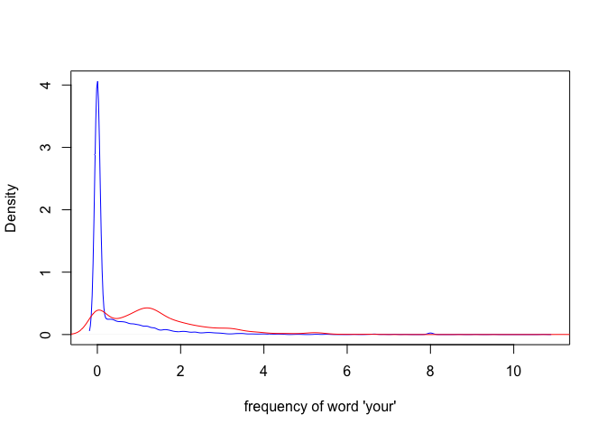
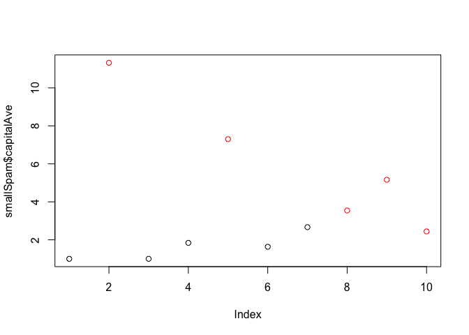

# Machine Learning: Prediction, Errors and Cross Validation
J Faleiro  
April 19, 2015  

# Required libraries


```r
if (!require("pacman")) install.packages("pacman")
pacman::p_load(caret, e1071, kernlab, ggplot2, ISLR, Hmisc, gridExtra, RANN, AppliedPredictiveModeling)
```

# Building a predictor

Steps:

1. Question
2. Input data
3. Features
4. Algorithm
5. Parameters
6. Evaluation

Spam example:


```r
library(kernlab)
data(spam)
head(spam$your)
```

```
## [1] 0.96 1.59 0.51 0.31 0.31 0.00
```

Density distributions of word 'your' in spam and non-spam emails


```r
plot(density(spam$your[spam$type=='nonspam']), 
     col='blue', main='', xlab="frequency of word 'your'")
lines(density(spam$your[spam$type=='spam']), col='red')
```



* what blue shows: a lot of non-spam emails have close to zero 'your'
* what red shows: a lot of spam emails have from 0 to 4, some with 8, words 'your'

Algorithm. put a cutoff threshold, right after the peak of blue non-spam emails. Anything having more 'your' word above that, is spam, not spam otherwise.


```r
prediction <- ifelse(spam$your > 0.5, 'spam', 'nonspam')
table(prediction, spam$type)/length(spam$type)
```

```
##           
## prediction   nonspam      spam
##    nonspam 0.4590306 0.1017170
##    spam    0.1469246 0.2923278
```

Meaning, with this simple algorithm you will be right about spam detection approximatelly 75% of the time:


```r
0.4590306 + 0.2923278
```

```
## [1] 0.7513584
```

# In sample error vs out of sample errors

Building a predictor in terms of average number of capital letters (`spam$capitalAve`):


```r
library(kernlab)
data(spam)
set.seed(333)
smallSpam <- spam[sample(dim(spam)[1], size=10),]
spamLabel <- (smallSpam$type=='spam')*1 + 1
plot(smallSpam$capitalAve, col=spamLabel)
```



We will build a predictor that separate red dots (spam) from black dots (ham) based on the average of capital letters:


```r
rule1 <- function(x) {
    prediction <- rep(NA, length(x))
    prediction[x > 2.7] <- 'spam'
    prediction[x < 2.4] <- 'nonspam'
    prediction[x >= 2.4 & x <= 2.45] <- 'spam'
    prediction[x > 2.45 & x <= 2.70] <- 'nonspam'
    return(prediction)
}
table(rule1(smallSpam$capitalAve), smallSpam$type)
```

```
##          
##           nonspam spam
##   nonspam       5    0
##   spam          0    5
```

100% correct, in sample error is zero


```r
rule2 <- function(x) {
    prediction <- rep(NA, length(x))
    prediction[x > 2.8] <- 'spam'
    prediction[x <= 2.8] <- 'nonspam'
    return(prediction)
}
table(rule2(smallSpam$capitalAve), smallSpam$type)
```

```
##          
##           nonspam spam
##   nonspam       5    1
##   spam          0    4
```

About 90% correct, in sample error is 10%

What if we apply to all data?


```r
table(rule1(spam$capitalAve), spam$type)
```

```
##          
##           nonspam spam
##   nonspam    2141  588
##   spam        647 1225
```

The out-sample error increased from 0 to 26.8419909% - this is an example of **overfitting**  - the rules were defined too tightly to the sample dataset.


```r
table(rule2(spam$capitalAve), spam$type)
```

```
##          
##           nonspam spam
##   nonspam    2224  642
##   spam        564 1171
```

How many times were we right for each rule (accuracy)?


```r
c(sum(rule1(spam$capitalAve) == spam$type),
  sum(rule2(spam$capitalAve) == spam$type))
```

```
## [1] 3366 3395
```

# Types of Errors

Suppose that we have created a machine learning algorithm that predicts whether a link will be clicked with 99% sensitivity and 99% specificity. The rate the link is clicked is 1/1000 of visits to a website. If we predict the link will be clicked on a specific visit, what is the probability it will actually be clicked?


```r
sensitivity <- specificity <- 0.99
population <- 100000 
rateClick <- 1/1000
```

$sensitivity = \frac {TP}{(TP + FN)}$


```r
FN <- 1
TP <- FN*sensitivity*100
```

$population = TP + FN + FP + TN$

$FP + TN = population - (FN + TP)$


```r
FPplusTN <- population - (FN + TP)
```

$specificity = \frac {TN}{(TN + FP)}$


```r
TN <- specificity * FPplusTN
FP <- population - (FN + TP + TN)
```


```r
c(TP, FP)
```

```
## [1]  99 999
```

```r
c(FN, TN)
```

```
## [1]     1 98901
```

Positive predictive value is the probablity the link will be clicked:

$PPV = \frac {TP}{(TP + FP)}$


```r
TP/(TP+FP)
```

```
## [1] 0.09016393
```

i.e. ~ **9.01%**
