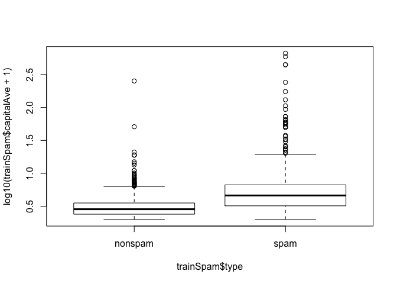
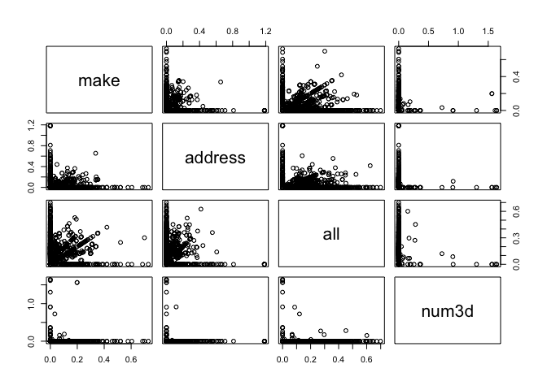
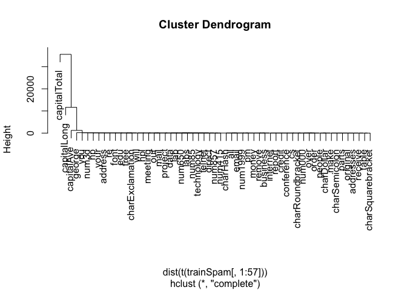
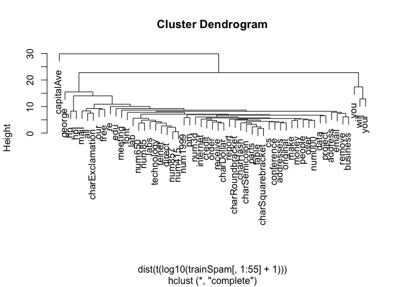

# Reproducible Research
J Faleiro  
March 19, 2015  

# Required libraries


```r
if (!require("pacman")) install.packages("pacman")
pacman::p_load(kernlab, UsingR, reshape, ggplot2, manipulate, dplyr, GGally, stats, rgl, car)
```

# SPAM Example


```r
library(kernlab)
data(spam)
```

## Data Loading and Sampling


```r
set.seed(3435)
trainIndicator = rbinom(nrow(spam), size=1, prob=0.5)
table(trainIndicator)
```

```
## trainIndicator
##    0    1 
## 2314 2287
```

```r
# training and testing data sets
trainSpam = spam[trainIndicator == 1, ]
testSpam = spam[trainIndicator == 0, ]
```

Some sampling:


```r
# number of spam/ham in training set
table(trainSpam$type)
```

```
## 
## nonspam    spam 
##    1381     906
```

Number of capital letters average per spam/ham type

## Preliminary Data Analysis


```r
plot(trainSpam$capitalAve ~ trainSpam$type)
```

<!-- -->

Same, but as a logarithmic distribution, add one because we have lots of zeroes:


```r
plot(log10(trainSpam$capitalAve + 1) ~ trainSpam$type)
```

<!-- -->

Pairs plot between predictors, correlation between predictors


```r
plot(log10(trainSpam[, 1:4] + 1))
```

<!-- -->

## Clustering

Clustering with no transformations, almost no clusters


```r
hCluster = hclust(dist(t(trainSpam[, 1:57])))
plot(hCluster)
```

<!-- -->

Clustering with transformations, several clusters


```r
hClusterTransformation = hclust(dist(t(log10(trainSpam[, 1:55] + 1))))
plot(hClusterTransformation)
```

<!-- -->

## Prediction


```r
trainSpam$numType = as.numeric(trainSpam$type) - 1
costFunction = function(x, y) sum(x != (y > 0.5))
cvError = rep(NA, 55)
library(boot)
for (i in 1:55) {
    lmFormula = reformulate(names(trainSpam)[i], response="numType")
    glmFit = glm(lmFormula, family="binomial", data=trainSpam)
    cvError[i] = cv.glm(trainSpam, glmFit, costFunction, 2)$delta[2]
}
```

Which predictor has minimum cross-validated error?


```r
sprintf("best predictor: %s", names(trainSpam)[which.min(cvError)])
```

```
## [1] "best predictor: charDollar"
```

The best predictor is 'charDollar'.

## Measure of Uncertainty

Use best predictor found above:


```r
predictionModel = glm(numType ~ charDollar, family="binomial", data=trainSpam)
```

```
## Warning: glm.fit: fitted probabilities numerically 0 or 1 occurred
```

```r
# get predictions on the test set
predictionTest = predict(predictionModel, testSpam)
predictedSpam = rep("nospam", dim(testSpam)[1]) # mark all as 'nospam' for now
# classify as 'spam' anything with a probability > 0.5
predictedSpam[predictionModel$fitted > 0.5] = 'spam'
# classification table
table(predictedSpam, testSpam$type)
```

```
##              
## predictedSpam nonspam spam
##        nospam    1346  458
##        spam        61  449
```

Mistakes are 61 + 458, so so calculare the `errorRate`:


```r
errorRate <- (61 + 458) / (1346 + 458 + 61 + 449)
sprintf('error rate: %s', errorRate)
```

```
## [1] "error rate: 0.22428694900605"
```

