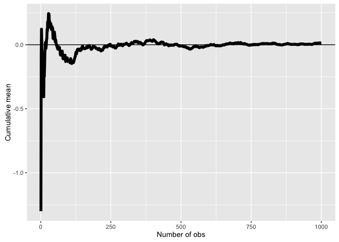
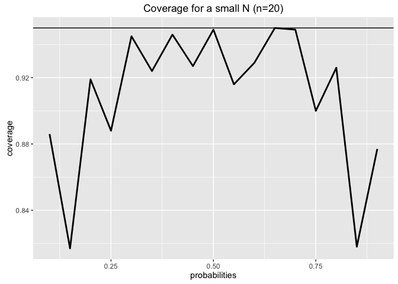
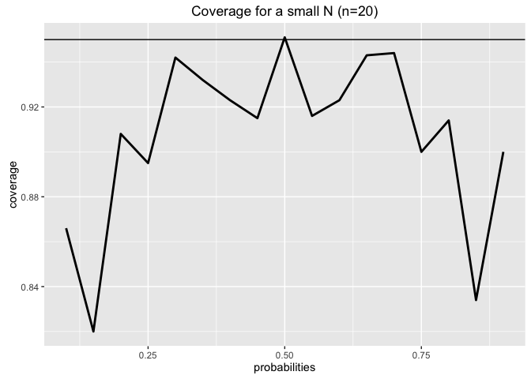
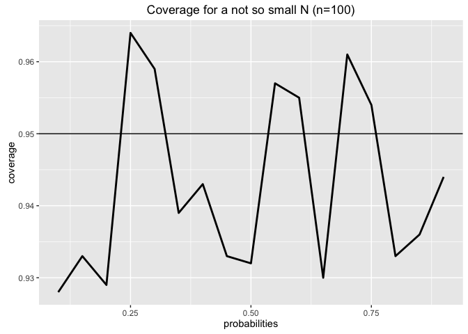
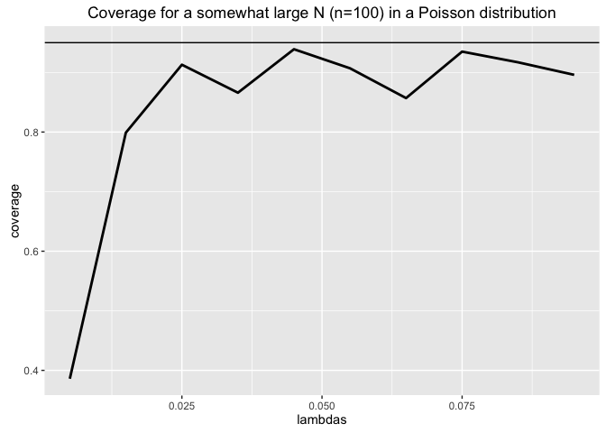
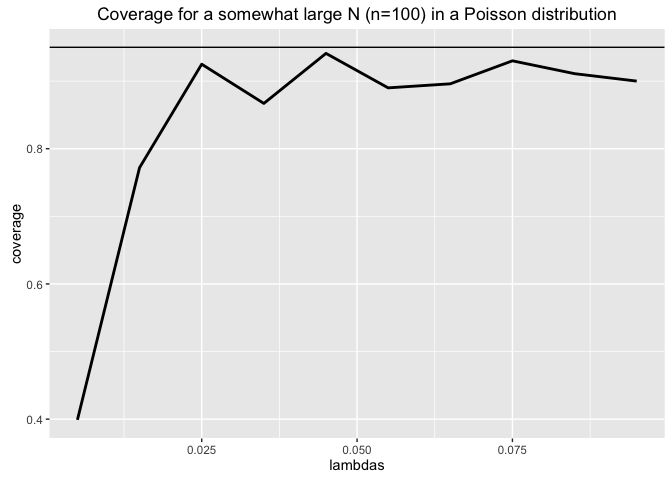

# Patterns for Statistical Inference
J Faleiro  
April 2, 2016  

## Probability Density Functions

Example of a PDF


```r
x <- c(-.5, 0, 1, 1, 1.5)
y <- c(0, 0, 2, 0, 0)
plot(x, y, lwd=3, frame=FALSE, type='l')
```


Is this a valid PDF?

* $p(x) >= 0$ everywhere? _yes_

* is $area = 1$? _yes_

this is a right triangle, so $area = (base * height) / 2$


```r
((1.0 - 0.0) * (2.0 - 0.0)) / 2 # area of right triangle
```

```
## [1] 1
```

What is the probability that 75% or less of the calls are addressed?


```r
(1.5 * 0.75) / 2 # area of the right triangle from 0..0.75
```

```
## [1] 0.5625
```

this is also a special distribution called a beta distribution


```r
pbeta(0.75, 2, 1) # R code for beta distribution of base 1 and height 2 (note p prefix for probability)
```

```
## [1] 0.5625
```

Note that prefix p<density-name> in R is for CDFs

What is the probability that 40, 50 and 60% of calls are addressed?


```r
pbeta(c(0.4, 0.5, 0.6), 2, 1) # beta distribution of heigth 2 and base 1
```

```
## [1] 0.16 0.25 0.36
```

What is the median of the distribution we are working?

Median on any distribution is the 50% percentile (0.5 quantile)


```r
qbeta(0.5, 2, 1) # 0.5 quantile of a beta distribution 
```

```
## [1] 0.7071068
```

What gives ~70% - that means in 50% of the days, about 70% of the calls or more are answered

Note a prefix q<dentity-name> prefix in R for quantile distributions

## Variability

Simulation example: simulations over standard normals


```r
simulations <- 1000
n <- 10
a <- rnorm(simulations * n) # simulations * n draws from a standard distribution
m <- matrix(a, simulations) # matrix of simulations rows and n columns
sd(apply(m, 1, mean)) # for each row calculate the mean and calculate the SD of them
```

```
## [1] 0.3225515
```

i.e. means of standard normals have $\sigma^2 = 1/\sqrt{n}$, we should get a value that is close enough below


```r
1 / sqrt(n)
```

```
## [1] 0.3162278
```

Simulation example: simulations over standard uniforms


```r
simulations <- 1000
n <- 10
a <- runif(simulations * n)
m <- matrix(a, simulations)
sd(apply(m, 1, mean))
```

```
## [1] 0.08953688
```

i.e. means of standard uniforms have $\sigma^2 = 1/\sqrt{12n}$, we should get a value that is close enough below


```r
1 / sqrt(12 * n)
```

```
## [1] 0.09128709
```

Simulation example: simulations of Poisson distributions (Poisson 4)


```r
simulations <- 1000
n <- 10
a <- rpois(simulations * n, 4) # simulations * n draws of a poisson 4
m <- matrix(a, simulations) 
sd(apply(m, 1, mean))
```

```
## [1] 0.63724
```

i.e. means of Poisson 4 distributions $\sigma^2 = 2/\sqrt{n}$, we should get a value that is close enough below


```r
2 / sqrt(n)
```

```
## [1] 0.6324555
```

Simulation example: Fair coin flips


```r
simulations <- 1000
n <- 10
a <- sample(0:1, simulations * n, replace=TRUE) # simulations * n flips of coin
m <- matrix(a, simulations) 
sd(apply(m, 1, mean))
```

```
## [1] 0.1636654
```

i.e. means of coin flips have $\sigma^2 = 1/{2\sqrt{n}}$, we should get a value that is close enough below


```r
1 / (2*sqrt(n))
```

```
## [1] 0.1581139
```

Data example


```r
library(ggplot2)
library(UsingR); data(father.son)
```


```r
x <- father.son$sheight
n <- length(x)
```

Plotting the distribution of son's heights:


```r
ggplot(data = father.son, aes(x = sheight)) +
    geom_histogram(aes(y = ..density..), fill = "lightblue", binwidth=1, colour = "black") +
    geom_density(size = 2, colour = "black")
```


Looks like (is) a gaussian distribution


```r
round(c(var(x), var(x)/n, sd(x), sd(x)/sqrt(n)),2) # get some numbers, round them to 2 dec places
```

```
## [1] 7.92 0.01 2.81 0.09
```

### Distributions

#### Binomial Trials

$P(X = x) = {n \choose x} p^x . (1 - p)^{n-x}$

What is the probability of getting 7 or more girls out of 8 births, assuming each gender has a 50% probability.

For 7 girls:

$P(X = 7) = {8 \choose 7} 0.5^7 . (1 - 0.5)^1$

For 8 girls:

$P(X = 8) = {8 \choose 8} 0.5^8 . (1 - 0.5)^0$


```r
choose(8,7) * .5^8 + choose(8,8) * .5^8
```

```
## [1] 0.03515625
```

The same results using a function for binominal trials


```r
pbinom(6, size=8, prob=.5, lower.tail=FALSE)
```

```
## [1] 0.03515625
```

#### Quantiles and Standard Normals

What is the 95th percetile of $X = N(\mu, \sigma^2)$ for $\mu = 10$ and $\sigma = 2$


```r
qnorm(.95, mean=10, sd=2)
```

```
## [1] 13.28971
```

Number of daily clicks on a web site is approx normally distributed with a daily mean of 1020 and SD of 50. What is the probability of getting more than 1160 clicks in a day?


```r
pnorm(1160, mean=1020, sd=50, lower.tail=FALSE) 
```

```
## [1] 0.00255513
```

Or, different way to solve it: How many SD from mean is 1160?


```r
(1160 - 1020) / 50
```

```
## [1] 2.8
```

It is 2.8 standard deviations from mean, so, equivalent to a standard normal (mean = 0, SD = 1)


```r
pnorm(2.8, lower.tail=FALSE) 
```

```
## [1] 0.00255513
```

Same parameters as before, but now what number of clicks would represent the one where 75% of days have fewer clicks?


```r
qnorm(.75, mean=1020, sd=50)
```

```
## [1] 1053.724
```

Note, pnorm and qnorm are inverses, i.e.:


```r
pnorm(qnorm(0.53))
```

```
## [1] 0.53
```

is 0.53, the same as 


```r
qnorm(pnorm(0.53))
```

```
## [1] 0.53
```

#### Poisson Distributions

The number of people that shows up at bus stop is Poisson with a mean of 2.5 per hour. If watching the bus stop for 4 hours, what is the probability that 3 or fewer people show up for the whole time?


```r
ppois(3, lambda=2.5*4)
```

```
## [1] 0.01033605
```

Approximation to Binomial

Poisson can be approximated to binomial when n is large and p is small, $\lambda = n * p$

We flip a coin with a success probability 0.01 five hundred times, what is the probability of 2 or fewer successes?


```r
pbinom(2, size=500, prob=0.01)
```

```
## [1] 0.1233858
```

very close result to


```r
ppois(2, lambda=500*0.01)
```

```
## [1] 0.124652
```

### Asymptotics

#### Law of Large Numbers (LLN) in Action

A note on how to use cumsum and a range to generate a running average:


```r
cumsum(c(1,3,2,4,5)) # numbers
```

```
## [1]  1  4  6 10 15
```

```r
cumsum(c(1,3,2,4,5))/(1:5) # cumsum of numbers / range is the running average
```

```
## [1] 1.0 2.0 2.0 2.5 3.0
```

With normal samples


```r
n <- 1000
means <- cumsum(rnorm(n))/(1:n)
ggplot(data.frame(x = 1:n, y = means), aes(x = x, y = y)) +
    geom_hline(yintercept = 0) + geom_line(size = 2) + 
    labs(x = "Number of obs", y = "Cumulative mean")
```



With coin flips


```r
means <- cumsum(sample(0:1, n, replace=TRUE))/(1:n) # sample() flips a coin 1000 times
ggplot(data.frame(x = 1:n, y = means), aes(x = x, y = y)) +
    geom_hline(yintercept = 0) + geom_line(size = 2) + 
    labs(x = "Number of obs", y = "Cumulative mean")
```


You see that the plots converges to 0.5 (the average you are trying to estimate)

#### Confidence Intervals

Give a confidence interval for the average height of sons

Confidence interval for 2 standard deviations: $\bar X \pm {2 \sigma} / {\sqrt{n}}$

Confidence interval for 97.5% percentile: $\bar X \pm {qnorm(0.975) \sigma} / {\sqrt{n}}$


```r
x <- father.son$sheight
(mean(x) + c(-1, 1) * qnorm(0.975) * sd(x) / sqrt(length(x)))/12
```

```
## [1] 5.709670 5.737674
```

From and to respectivelly. Divided by 12 to have the result in inches, not feet.

In an election your advisor tells you that out of 100 interviewed electors 56 plan in voting for you. Can you assume this election won?

For 95% confidence intervals, $\hat p \pm 1/\sqrt{n}$

For 0.975 quantile, $\hat p \pm \sqrt{p(1-p)/n}$:


```r
0.56 + c(-1, 1) * qnorm(0.975) * sqrt(0.56 * 0.44/100)
```

```
## [1] 0.4627099 0.6572901
```

what is equivalent to


```r
binom.test(56, 100)$conf.int # 56 successes out of 100 trials
```

```
## [1] 0.4571875 0.6591640
## attr(,"conf.level")
## [1] 0.95
```

##### Simulation of a coin flip

Let's see if lower and upper limit of a simulation go above a 95% confidence interval:


```r
n <- 20 # number of coin flips on each simulation
pvals <- seq(0.1, 0.9, by=0.05) # success probabilities
simulations <- 1000 # number of simulations
coverage <- sapply(pvals, function(p) { # for each probability
    phats <- rbinom(simulations, prob=p, size=n)/n # generate 1000 binomial simulations with prob p size n
    ll <- phats - qnorm(0.975) * sqrt(phats * (1 - phats)/n) # lower limit
    ul <- phats + qnorm(0.975) * sqrt(phats * (1 - phats)/n) # upper limit
    mean(ll < p & ul > p) # proportion of times they cover the range used to simulate the data
})
ggplot(data.frame(x=pvals, y=coverage), aes(x=x, y=y)) +
    geom_hline(yintercept=0.95) + geom_line(size=1) + 
    ggtitle('Coverage for a small N (n=20)') +
    labs(x="probabilities", y="coverage")
```



For n=20 we barely go above a 95% confidence interval.

This is because CLT does not behave well for small numbers of n. Let's try the same with a larger n, say n=100


```r
n <- 100 # number of coin flips on each simulation
pvals <- seq(0.1, 0.9, by=0.05) # success probabilities
simulations <- 1000 # number of simulations
coverage <- sapply(pvals, function(p) { # for each probability
    phats <- rbinom(simulations, prob=p, size=n)/n # generate 1000 binomial simulations with prob p size n
    ll <- phats - qnorm(0.975) * sqrt(phats * (1 - phats)/n) # lower limit
    ul <- phats + qnorm(0.975) * sqrt(phats * (1 - phats)/n) # upper limit
    mean(ll < p & ul > p) # proportion of times they cover the range used to simulate the data
})
ggplot(data.frame(x=pvals, y=coverage), aes(x=x, y=y)) +
    geom_hline(yintercept=0.95) + geom_line(size=1) + 
    ggtitle('Coverage for a not so small N (n=100)') +
    labs(x="probabilities", y="coverage")
```



We have now several instances where we go above the 95% interval. In each simulation, we have more coin flips, the CLT performs better.

There is a quick fix for CLT on binomial distributions: Agresti/Coull interval. Add 2 success to the random variable and 2 sucesses and 2 failures to number of trials, so that:

$\hat p \pm \sqrt{p(1-p)+2/{n+4}}$:

Let's add 2 successes and 2 failures to the model before and watch how it performs:


```r
n <- 20 # number of coin flips on each simulation
pvals <- seq(0.1, 0.9, by=0.05) # success probabilities
simulations <- 1000 # number of simulations
coverage <- sapply(pvals, function(p) { # for each probability
    phats <- (rbinom(simulations, prob=p, size=n) + 2) /(n + 4) # add 2 failures and 2 successes (Agrest)
    ll <- phats - qnorm(0.975) * sqrt(phats * (1 - phats)/n) # lower limit
    ul <- phats + qnorm(0.975) * sqrt(phats * (1 - phats)/n) # upper limit
    mean(ll < p & ul > p) # proportion of times they cover the range used to simulate the data
})
ggplot(data.frame(x=pvals, y=coverage), aes(x=x, y=y)) +
    geom_hline(yintercept=0.95) + geom_line(size=1) + 
    ggtitle('Coverage for a small N (n=20) using Agresti/Coull Interval') +
    labs(x="probabilities", y="coverage")
```



So it is kept aabove the 95% confidence interval for all trials of the simulation.

It is recommended the use of Agresti/Coull interval instead of the Wald interval, practical results are better.

##### Confidence Interval of a Poisson Distribution

A nuclear pump failed 5 times out ot 94.32 days. Give a 95% interval for the failure rate per day.


```r
x <- 5
t <- 94.32
lambda <- x/t
round(lambda + c(-1, 1) * qnorm(0.975) * sqrt(lambda/t), 3)
```

```
## [1] 0.007 0.099
```

or in other way:


```r
poisson.test(x, T=94.32)$conf
```

```
## [1] 0.01721254 0.12371005
## attr(,"conf.level")
## [1] 0.95
```

Simulation to detect the performance of Poission distributions over different values of lambda


```r
lambdavals <- seq(0.005, 0.1, by=0.01)
simulations <- 1000
t <- 100
coverage <- sapply(lambdavals, function(lambda) {
    lhats <- rpois(simulations, lambda=lambda*t)/t
    ll <- lhats - qnorm(0.975) * sqrt(lhats/t)
    ul <- lhats + qnorm(0.975) * sqrt(lhats/t)
    mean(ll < lambda & ul > lambda)
})
ggplot(data.frame(x=lambdavals, y=coverage), aes(x=x, y=y)) +
    geom_hline(yintercept=0.95) + geom_line(size=1) + 
    ggtitle('Coverage for a somewhat large N (n=100) in a Poisson distribution') +
    labs(x="lambdas", y="coverage")
```



Never really good, but really bad for small values of lambda. Does it get any better in higher N? 


```r
lambdavals <- seq(0.005, 0.1, by=0.01)
simulations <- 1000
t <- 1000
coverage <- sapply(lambdavals, function(lambda) {
    lhats <- rpois(simulations, lambda=lambda*t)/t
    ll <- lhats - qnorm(0.975) * sqrt(lhats/t)
    ul <- lhats + qnorm(0.975) * sqrt(lhats/t)
    mean(ll < lambda & ul > lambda)
})
ggplot(data.frame(x=lambdavals, y=coverage), aes(x=x, y=y)) +
    geom_hline(yintercept=0.95) + geom_line(size=1) + 
    ggtitle('Coverage for a larger N (n=1000) in a Poisson distribution') +
    labs(x="lambdas", y="coverage")
```




### Student's T Confidence Intervals

#### Biometrika Analysis

Quick analysis of the dataframe used by William Gosset (aka Student) in his Biometrika paper, which shows the increase in hours for 10 patients on 2 sleeping drugs.

The group indicates the drug, subjects are repeated, i.e. subject 1 and 11 are the same, so is 2 and 12.


```r
data(sleep)
head(sleep)
```

```
##   extra group ID
## 1   0.7     1  1
## 2  -1.6     1  2
## 3  -0.2     1  3
## 4  -1.2     1  4
## 5  -0.1     1  5
## 6   3.4     1  6
```

Shows number of extra hours slept, group id and id of the subject.


```r
ggplot(sleep, aes(x = group, y = extra, group = factor(ID))) +
    geom_line(size = 1, aes(colour = ID)) + 
    geom_point(size =10, pch = 21, fill = "salmon", alpha = .5)
```


Lines connect the same subjects across different drugs, we can clearly see that drug 2 has a stronger impact in hours slept than drug 1.

Let's calculate the Student's T 95% confidence interval.

First calculate the difference between drugs, and the mean and standard deviation of the differences:


```r
g1 <- sleep$extra[1:10]; g2 <- sleep$extra[11:20]
difference <- g2 - g1
mn <- mean(difference); s <- sd(difference); n <- 10
c(mn, s)
```

```
## [1] 1.580000 1.229995
```

The confidence interval of the Student's T distribution. The quantile is calculated by (100-CI%)/2 + CI%, hence for 95% CI the quantile is 0.975 (Why 0.975? Because there's 0.025 to the right, and therefore 0.975 to the left):


```r
quantile <- (100-95)/2 + 95 # 97.5
quantile
```

```
## [1] 97.5
```

```r
mn + c(-1, 1) * qt(quantile/100, n-1) * s / sqrt(n)
```

```
## [1] 0.7001142 2.4598858
```

These should yield similar results:


```r
t.test(difference)
```

```
## 
## 	One Sample t-test
## 
## data:  difference
## t = 4.0621, df = 9, p-value = 0.002833
## alternative hypothesis: true mean is not equal to 0
## 95 percent confidence interval:
##  0.7001142 2.4598858
## sample estimates:
## mean of x 
##      1.58
```


```r
t.test(g2, g1, paired=TRUE)
```

```
## 
## 	Paired t-test
## 
## data:  g2 and g1
## t = 4.0621, df = 9, p-value = 0.002833
## alternative hypothesis: true difference in means is not equal to 0
## 95 percent confidence interval:
##  0.7001142 2.4598858
## sample estimates:
## mean of the differences 
##                    1.58
```


```r
t.test(extra ~ I(relevel(group, 2)), paired=TRUE, data=sleep)
```

```
## 
## 	Paired t-test
## 
## data:  extra by I(relevel(group, 2))
## t = 4.0621, df = 9, p-value = 0.002833
## alternative hypothesis: true difference in means is not equal to 0
## 95 percent confidence interval:
##  0.7001142 2.4598858
## sample estimates:
## mean of the differences 
##                    1.58
```

These all say that with probability .95 the average difference of effects (between the two drugs) for an individual patient is between 0.7 and 2.46 additional hours of sleep.


##### Comparing Independent Groups

Comparing SBP (systolic blood pressure) for 8 contraceptive users versus 21 controls:

Contraceptive users: $\bar X = 132.66 mmHg$ and $S = 15.34 mmHg$

Control group: $\bar X = 127.44 mmHg$ and $S = 18.23 mmHg$

Calculate the pooled variance estimate:


```r
sp <- sqrt((7 * 15.34^2 + 20 * 18.23^2) / (8 + 21 -2))
(132.86 - 127.44) + c(-1, 1) * qt(.975, 27) * sp * (1/8 + 1/21)^.5
```

```
## [1] -9.521097 20.361097
```

##### Mistakenly Treating Data as Grouped

What happens when you use `t.test` and `paired=TRUE` when data is not paired? Back to the paired database:


```r
n1 <- length(g1); n2<- length(g2)
sp <- sqrt( ((n1 -1) * sd(g1)^2 + (n2-1) * sd(g2)^2) / (n1 + n2 - 2))
md <- mean(g2) - mean(g1)
semd <- sp * sqrt(1/n1 + 1/n2)
rbind(
    md + c(-1, 1) * qt(.975, n1 + n2 - 2) * semd,
    t.test(g2, g1, paired=FALSE, var.equal=TRUE)$conf,
    t.test(g2, g1, paired=TRUE)$conf
    )
```

```
##            [,1]     [,2]
## [1,] -0.2038740 3.363874
## [2,] -0.2038740 3.363874
## [3,]  0.7001142 2.459886
```

##### Handling Chick Weight

Load chickweight

```r
library(datasets); data("ChickWeight"); library(reshape2); library(dplyr)
head(ChickWeight)
```

```
##   weight Time Chick Diet
## 1     42    0     1    1
## 2     51    2     1    1
## 3     59    4     1    1
## 4     64    6     1    1
## 5     76    8     1    1
## 6     93   10     1    1
```

Let's look at the data first before we run our tests in a spaguetti plot. 


```r
ggplot(ChickWeight, aes(x = Time, y = weight, colour = Diet, group = Chick)) +
    geom_line() +
    stat_summary(aes(group = 1), geom = "line", fun.y = mean, size = 1, col = "black") +
    facet_grid(. ~ Diet)
```


In dark the averages. We can see that diet 3 and 4 do seem to behave better than 1 and 2, but let's look at confidence intervals of those measurements. Let's do some transformations first.

ChickWeight is in a narrow format, let's make it wide:


```r
wideCW <- dcast(ChickWeight, Diet + Chick ~ Time, value.var='weight')
head(wideCW)
```

```
##   Diet Chick  0  2  4  6  8 10 12 14 16  18  20  21
## 1    1    18 39 35 NA NA NA NA NA NA NA  NA  NA  NA
## 2    1    16 41 45 49 51 57 51 54 NA NA  NA  NA  NA
## 3    1    15 41 49 56 64 68 68 67 68 NA  NA  NA  NA
## 4    1    13 41 48 53 60 65 67 71 70 71  81  91  96
## 5    1     9 42 51 59 68 85 96 90 92 93 100 100  98
## 6    1    20 41 47 54 58 65 73 77 89 98 107 115 117
```

Renaming the time columns:


```r
names(wideCW)[-(1:2)] <- paste('time', names(wideCW)[-(1:2)], sep='')
head(wideCW)
```

```
##   Diet Chick time0 time2 time4 time6 time8 time10 time12 time14 time16
## 1    1    18    39    35    NA    NA    NA     NA     NA     NA     NA
## 2    1    16    41    45    49    51    57     51     54     NA     NA
## 3    1    15    41    49    56    64    68     68     67     68     NA
## 4    1    13    41    48    53    60    65     67     71     70     71
## 5    1     9    42    51    59    68    85     96     90     92     93
## 6    1    20    41    47    54    58    65     73     77     89     98
##   time18 time20 time21
## 1     NA     NA     NA
## 2     NA     NA     NA
## 3     NA     NA     NA
## 4     81     91     96
## 5    100    100     98
## 6    107    115    117
```

Make a new column, gain, as the difference between first and last measurements


```r
wideCW <- mutate(wideCW, gain=time21-time0)
```

Now analysis: let's look at the gain by diet, and verify by a T confidence interval the variance of 1 and 4:


```r
ggplot(wideCW, aes(x = factor(Diet), y = gain, fill = factor(Diet))) +
    geom_violin(col = "black", size = 2)
```


We are going to compare diet 1 and diet 4 - our assumption of equal variances does not seem to hold for this case, but let's test them anyways.


```r
wideCW14 <- subset(wideCW, Diet %in% c(1,4))
rbind(
    t.test(gain ~ Diet, paired=FALSE, var.equal=TRUE, data=wideCW14)$conf,
    t.test(gain ~ Diet, paired=FALSE, var.equal=FALSE, data=wideCW14)$conf
)
```

```
##           [,1]      [,2]
## [1,] -108.1468 -14.81154
## [2,] -104.6590 -18.29932
```

On the first case, we considered the variance the same and on the second different. 

##### T Tests

Going back to our father/son height database. We want to test or $H_0$ that fathers and sons have similar heights. We can start by running `t.test`: 


```r
t.test(father.son$sheight- father.son$fheight)
```

```
## 
## 	One Sample t-test
## 
## data:  father.son$sheight - father.son$fheight
## t = 11.7885, df = 1077, p-value < 2.2e-16
## alternative hypothesis: true mean is not equal to 0
## 95 percent confidence interval:
##  0.8310296 1.1629160
## sample estimates:
## mean of x 
## 0.9969728
```

From that, you can see the test statistic is $t = 11.7885$. The value $t$ is quite large so we REJECT $H_0$ that the true mean of the difference was 0.

The test statisticc $t$ is also the number of estimated std errors between the sample and hypothesized means, i.e. 

$mean(differences) = t * sd(differences)/\sqrt{n}$

where `differences` is `father.son$sheight- father.son$fheight`, and $n = df + 1$ i.e.:


```r
11.7885 * sd(father.son$sheight- father.son$fheight)/sqrt(1078)
```

```
## [1] 0.9969686
```

What is close enough to `mean of x` from `t.test` above.

Also, note that the confidence interval `CI` does not contain the hypothesized population mean 0 in $H_0$, so we can safely reject $H_0$.

This tells us that either our hypothesis $H_0$ is wrong or we're making a mistake (Type 1) in rejecting it.

Similarly, if a $(1-\alpha)%$ interval contains $\mu_0$ ($H_0$'s $\mu$), then we fail to reject $H_0$.


### P-Values

Suppose you get a $T$ statistic of 2.5 for 15 $df$ testing $H_0 : \mu = \mu_0$ versus $H_a : \mu > \mu_0$. 

What is the probability of getting a $T$ statistic as large as 2.5?


```r
pt(2.5, 15, lower.tail=FALSE)
```

```
## [1] 0.0122529
```

I.e, 2.27%

And what is the probability of getting a $T$ statistic of less or equal than 2.5?


```r
pt(2.5, 15, lower.tail=TRUE)
```

```
## [1] 0.9877471
```

What is around 98.77%

#### Attained Significance Level

Attained significance level is the lowest value of $\alpha$ where you will still reject $H_0$.

Example: A test statistic was 2 (2 standard errors above the hypothesis mean of 30), $H_0 : \mu = 30$ versus $H_a : \mu > 30$. Let's assume a standard normal test statistic. We rejected $\alpha = 0.05$. Will we reject $\alpha = 0.01$? What about $\alpha = 0.001$?

p-value:

(a) The value above the line where SD=2, or in other words:
(b) The smallest value of $\alpha$ where we will still reject the null hypothesis


```r
pnorm(2, lower.tail=FALSE)
```

```
## [1] 0.02275013
```

So, we reject $H_0$ for any $\alpha$ > 0.0227

#### Binomial Example - one sided

A friend has 8 children, 7 are girls and no twins. If each birth is 50% probability boy/girl, what is the probability of getting 7 or more girls in 8 births?

$H_0 : p = 0.5$

$H_a : p > 0.5$

P-value, probability under $H_0$, i.e.:


```r
choose(8,7)*0.5^8 + choose(8,8)*0.5^8
```

```
## [1] 0.03515625
```

what is equivalent to:


```r
pbinom(6, size=8, prob=0.5, lower.tail=FALSE)
```

```
## [1] 0.03515625
```

So, we will reject any $H_0$ for which p-value > 0.03515

#### Binomial Example - one sided

Follow a black magic procedure:

1.  Calculate 2 sides probability:


```r
leftPValue <- pbinom(6, size=8, prob=0.5, lower.tail=FALSE)
rightPValue <-pbinom(7, size=8, prob=0.5, lower.tail=TRUE) 
c(leftPValue, rightPValue)
```

```
## [1] 0.03515625 0.99609375
```

2. Take the smaller side


```r
smallerPValue <- min(leftPValue, rightPValue)
```

3. p-value is double the smaller side


```r
pValue <- smallerPValue * 2
pValue
```

```
## [1] 0.0703125
```

So, we will reject any two sided $H_0$ for which p-value > 0.07031

#### Poisson Example

Hospital has an infection rate of 10 infections per 100 person/days at risk. Infection rate of 0.05 is a benchmark, if above that we have to implement expensive quality control procedures.

Given that, can a rate > 0.05 be attributed to chance?

$H_0 : \lambda_0 = 0.05$

$H_a : \lambda > 0.05$


```r
t <- 100
lambda <- 0.05
events <- 10
leftSideEvents <- events - 1
ppois(leftSideEvents, t * lambda, lower.tail=FALSE)
```

```
## [1] 0.03182806
```

So, the probability of that infection rate be attributed to chance is only 3.18% - so chance can be safely ruled out and this hospital should implement some quality control procedures.
